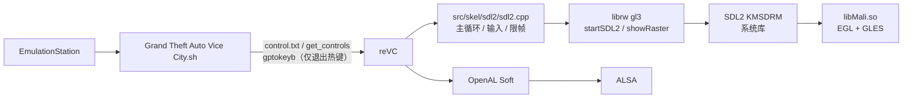
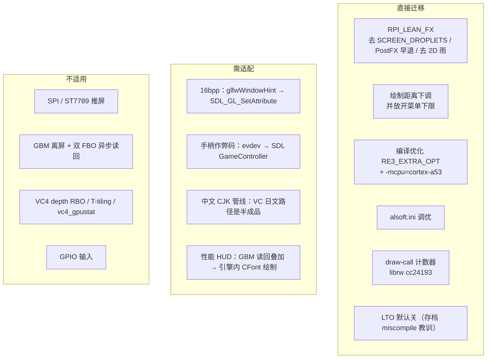
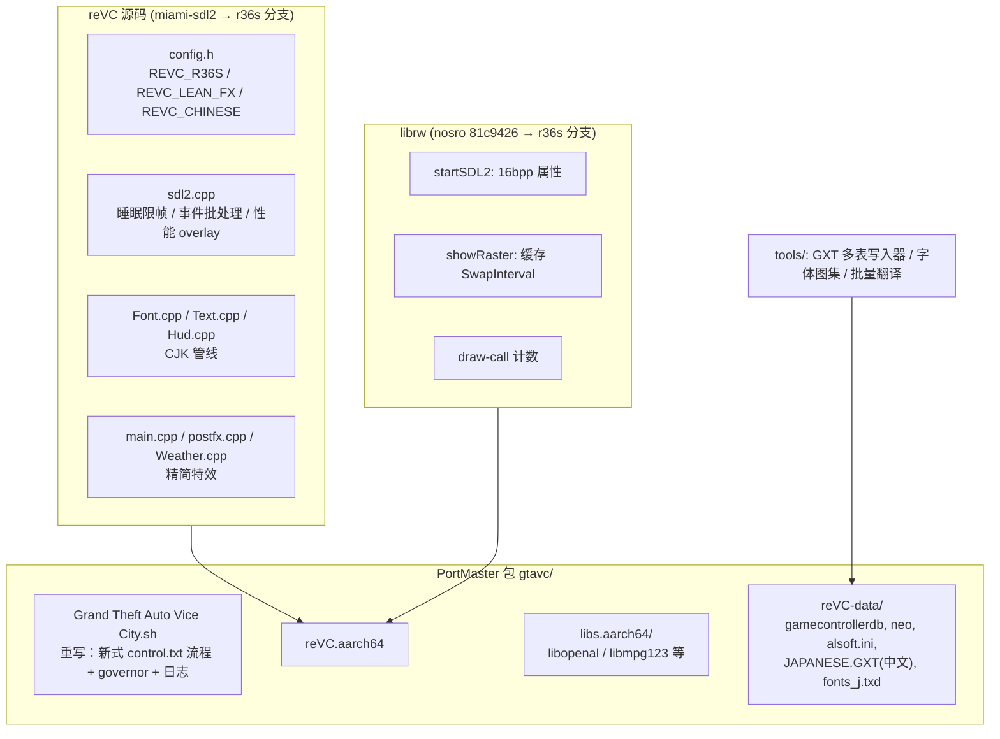
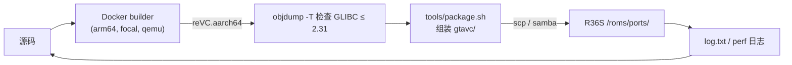
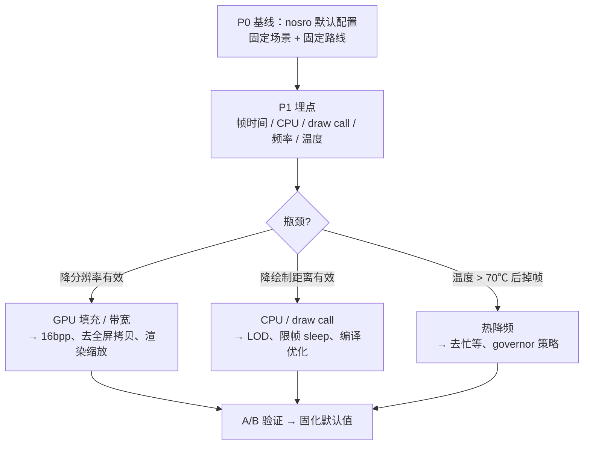
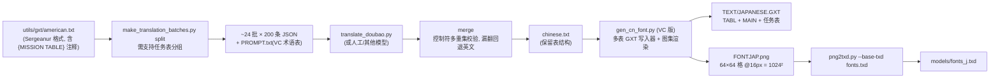
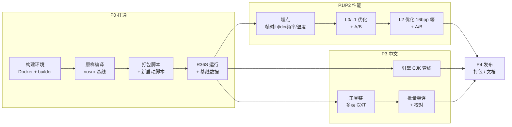

# 01 - R36S 罪恶都市（reVC）移植与优化设计方案

> 状态：设计稿 v0.1（2026-09-26）
> 基线：`PortMaster/re3-sdl`，分支 `miami-sdl2`，HEAD `b9f0b234`（fork 自 nosro1/re3）
> 参考：`re3`（`rpi-perf-optimization`，GTA3 Pi Zero 2W 优化版）、`re3/vendor/librw`（FASTSHIFT/librw `rpi-perf-optimization`）
> 目标系统：`dArkOSen-R36S`（dArkOS trixie，aarch64）

文中的「已核实」表示已读过代码或跑过命令确认；「待实测」表示需要真机数据，现在只是推断。

---

## 1. 目标与非目标

**目标**
1. 本地打通「编译 → 打包 → 部署 → R36S 运行」全链路，产物形态与 PortMaster port 一致。
2. 以数据为准提升帧率与稳定性，把 GTA3/Pi 上验证过的引擎级优化迁移过来。
3. 简体中文本地化，复用 GTA3 的翻译工作流。

**非目标**
- 不重写平台层。SDL2 保留，理由见 §4.3。
- 不迁移 Pi 专属的 SPI 推屏、GBM 离屏渲染、双 FBO 读回流水线，也不迁移 GPIO 输入。
- 不分发游戏资源。reVC 需要玩家自备正版 PC 版 VC 资源。

---

## 2. 现状

### 2.1 仓库与分支（已核实）

| 仓库 | remote / 分支 | 内容 |
|---|---|---|
| `PortMaster/re3-sdl` | FASTSHIFT/re3-sdl `miami-sdl2` | **本方案基线**。VC `GTA_VERSION=GTAVC_PC_11` |
| `PortMaster/re3-sdl/vendor/librw` | nosro1/librw `81c9426` | SDL2 子系统补全，加 `LIBRW_FORCE_GLES` |
| `re3` | FASTSHIFT/re3 `rpi-perf-optimization` | GTA3，基于 master 的 87 个提交 |
| `re3/vendor/librw` | FASTSHIFT/librw `691f9e2` | Pi 专用改动（10 个提交，+414/-18 行） |
| `re3-VC` | FASTSHIFT/re3-VC `miami` | 干净的上游 VC，只作对照 |

nosro 在上游 miami 之上的改动（`git diff a16fcd8d HEAD`）有两类：
- 新增 `src/skel/sdl2/sdl2.cpp`（1948 行）；
- 手柄配置、摇杆死区/灵敏度，以及 `config.h` 里的几处性能开关（commit `1c2471d0`：关 `AUDIO_REVERB`、`USE_TXD_CDIMAGE`、`ANISOTROPIC_FILTERING`，开 `SQUEEZE_PERFORMANCE`）。

### 2.2 目标硬件（已核实，来自 dArkOSen dtb 和配置）

| 项 | R36S | Pi Zero 2W（对照） |
|---|---|---|
| SoC | RK3326，4× Cortex-A53 | BCM2837，4× Cortex-A53 |
| CPU 频率 | 默认 1296MHz（ondemand），OC 最高 1512 | 1000 → OC 1200 |
| GPU | Mali-G31（Bifrost），闭源 libMali blob | VC4，Mesa 开源驱动 |
| 图形栈 | SDL2 KMSDRM → EGL/GLES（全部软链到 `libMali.so`，见 `mod_dArkOS.txt`） | GBM/EGL 离屏，glReadPixels 后 SPI 推屏 |
| 屏幕 | 640×480 DSI | 320×240 SPI |
| 用户态 | **aarch64**，glibc 较新（trixie） | armhf |
| 内存 | 1GB，加 zram 768MB | 512MB |

两台机器 CPU 同架构，GPU 与显示管线完全不同。所以 Pi 的 CPU 侧经验大多能迁移，GPU 和显示侧的经验大多不能。

### 2.3 基线运行链路

### 2.4 基线中的性能问题（已核实）

| # | 问题 | 位置 | 影响 |
|---|---|---|---|
| P1 | **限帧器忙等**：`GS_PLAYING_GAME` 时循环判断 `1000/maxFPS < ms`，中间不 sleep；`maxFPS=30` 写死 | `sdl2.cpp` L1666-1672，`skeleton.cpp` L406 | 空转占满一个核，发热导致降频（70℃ 开始降），和音频线程抢 CPU（待实测） |
| P2 | **SCREEN_DROPLETS 每帧都做全屏 backbuffer 拷贝**，不管是否下雨 | `main.cpp` L1632-1636，`config.h` L321 | 每帧额外一次 640×480 拷贝加一个后处理 pass |
| P3 | **PostFX 默认 NORMAL 调色**：MotionBlur 关闭时 `NeedBackBuffer()` 为真，于是每帧再拷一次 backbuffer | `extras/postfx.cpp` L19、L337、L407 | 又一次全屏拷贝加 overlay pass |
| P4 | 每帧调用 `SDL_GL_SetSwapInterval(0/1)` | `librw gl3device.cpp` L1405-1415 | 某些 EGL 驱动上有额外开销（待实测） |
| P5 | 绘制距离默认 `1.2`，菜单最低只能调到 `0.925` | `Renderer.cpp` L69，`Frontend.cpp` L738 | GTA3/Pi 上 1.2→0.8 带来 +7fps |
| P6 | 没有设置颜色和深度位数，按驱动默认（通常 RGB888 + D24） | `startSDL2` L1553 附近 | 带宽；Pi 上 16bpp 带来 +11% |
| P7 | 编译只用 Release 默认的 `-O3`，没有 `-mcpu`、`--gc-sections` 等 | `CMakeLists.txt` | 小幅收益 |
| P8 | 没定义 `FINAL`，所以 `TIMEBARS` 和 `DEBUGMENU` 都编进去了 | `config.h` L199、L277 | 开销小，但发布版不需要 |
| P9 | 每次循环只 `SDL_PollEvent` 一个事件 | `sdl2.cpp` L1248 | 输入延迟和事件堆积（待实测） |

另外，VC 比 GTA3 多了 `EXTENDED_PIPELINES`（Neo 车辆/世界/光泽/边缘光管线，默认 `VehiclePipeSwitch=MATFX`）和 `NEW_RENDERER`（运行时默认关）。它们在 Mali 上的代价**待实测**。

---

## 3. GTA3/Pi 优化经验的迁移评估

各项的迁移位置：

| 优化 | Pi 实测收益 | VC 中的位置 | 迁移方式 |
|---|---|---|---|
| 去 SCREEN_DROPLETS | 下雨时 12→20+ fps | `config.h` L321 | 加宏开关 `REVC_LEAN_FX` |
| PostFX 早退 / 默认 SIMPLE | 常驻全屏拷贝没了 | `postfx.cpp` `CPostFX::Render` L390 起 | 同上；也可以只改 ini 默认值 |
| 去 2D 雨滴 | 与上一项合计 | `Weather.cpp` `AddRain` L427 起 | VC 的结构不同，需要手工对照 |
| 绘制距离 0.8 | +7fps | `Frontend.cpp` L738 clamp、`Renderer.cpp` L69 | 放开下限，改默认值 |
| 16bpp | 平均 +11% | librw `startSDL2` | `SDL_GL_RED/GREEN/BLUE_SIZE=5/6/5`，`DEPTH_SIZE=16`；Mali 是否会选中 565 的 EGLConfig 待实测 |
| EXTRA_OPT | 小（没有单独量化） | 顶层 `CMakeLists.txt` | 照搬 flag，`-mcpu=cortex-a53` |
| LTO | 有收益，但存档时 miscompile，严重时整机卡死 | — | **默认关**，保留为 opt-in |
| draw-call 计数 | 定位工具 | librw `gl3render.cpp` / `gl3immed.cpp` | 直接 cherry-pick `cc24193` |
| 异步双 FBO | +10fps | — | **不适用**。R36S 直接显示，`eglSwapBuffers` 本身就是异步的，不存在 glFinish 加读回的串行问题 |

**librw 的处理**：FASTSHIFT fork 的 SDL2 路径里没有 nosro 的 `bb74d34`（SDL2 子系统补全和 GLES 3.2 兼容）。所以**不能整体替换 vendor/librw**。做法是在 nosro 的 librw 上开一个新分支（FASTSHIFT/librw `r36s`），把可迁移的提交 cherry-pick 或重写过去。

---

## 4. 总体方案

### 4.1 架构（改动点）

所有改动都放在宏或 CMake 选项后面（`REVC_R36S=ON` 时默认开启），关掉以后行为和 nosro 基线一致，方便做 A/B 对比，也方便以后合并上游。

### 4.2 构建环境

宿主机（已核实）：
- Ubuntu 24.04 x86_64；
- 没有预装 docker、podman，也没有 aarch64 交叉工具链；
- `qemu-user-binfmt` 已装，但 binfmt 标志里没有 `F`，所以 chroot 里用不了。

PortMaster 官方的推荐是**在 aarch64 Ubuntu 20.04（glibc 2.31）里编译**，这样所有 CFW 都能跑。官方提供了现成镜像 `ghcr.io/monkeyx-net/portmaster-build-templates/portmaster-builder:aarch64-latest`（来源：[PortMaster Docker 文档](https://portmaster.games/docker.html)、[构建环境](https://portmaster.games/build-environments.html)）。不需要 clone 几个 G 的 PortMaster-New，那个仓库只是 port 的发布源。

| 方案 | 优点 | 缺点 |
|---|---|---|
| **A. Docker + 官方 builder 镜像（qemu）** | 与 PortMaster 官方环境一致；glibc 兼容性有保证；可复现 | 要装 docker；qemu 下编译大约慢 3–5 倍（全量预计十几分钟，待实测） |
| B. mmdebstrap 建 focal arm64 rootfs + chroot | 不用 docker | 要装 `qemu-user-static`；要自己维护依赖 |
| C. 宿主机交叉编译（`aarch64-linux-gnu` + 用镜像导出的 sysroot） | 编译最快，适合频繁迭代 | 要维护 sysroot 和 pkg-config 路径 |

**推荐 A 作为权威构建，C 作为后续的快速迭代通道**：把 A 的镜像文件系统导出成 sysroot，给 C 用，保证两边的库版本一致。

**打包原则**：
- 不打包 SDL2 和 GLES/EGL，用系统自带的（和 KMSDRM、Mali 驱动绑定）；
- 只把非标准库放进 `libs.aarch64/`；
- 启动脚本按新式 PortMaster 规范重写（`controlfolder` → `control.txt` → `mod_${CFW_NAME}.txt` → `get_controls` → `$GPTOKEYB` → 运行 → `pm_finish`）。

旧启动脚本有 bug，不要照抄：`SIPLAY_ID`/`DSIPLAY_ID` 拼错了；还引用了从未定义的 `${RE3}`。

### 4.3 是否换掉 SDL2

结论是不换。理由：
- 在 R36S 上，SDL2 KMSDRM 本身就是 `GBM + EGL + drmModePageFlip`。每帧的开销基本上只有 `eglSwapBuffers` 加一次 page flip，SDL 自己这层很薄。
- Pi 上自研 GBM 后端能快，是因为那边必须离屏渲染再读回推 SPI。R36S 不存在这个问题。
- 真正可能省下来的是 P1（忙等）和 P4（每帧 SetSwapInterval）。这两个在 SDL 内部就能修好。

以后如果 perf 显示 SDL/KMSDRM 路径占比明显（比如大于 5%），再评估直连 KMS。先用数据说话。

---

## 5. 性能优化设计

### 5.1 方法：先测再改

沿用 Pi 上的受控实验法：一次只改一个变量，看帧时间怎么变。

**测试场景**（固定三个）：
1. 室外白天，开车穿过 Ocean Beach；
2. 下雨天；
3. 人车密集的 Downtown。

每个场景采 120 帧，统计平均、1% low 和最低帧。

**埋点**（`REVC_PERF_HUD`，运行时用 ini 或环境变量开关）：
- 每 120 帧输出一行 `[perf] frame= cpu= swap= dc= fps= freq= temp=` 到 stdout/log；
- 可选用 `CFont` 在屏幕角落画出来；
- 数据来源：draw-call 计数来自 librw `cc24193`，CPU 频率和温度读 `/sys`；
- 不做 GPU 计数器（Mali blob 没有现成工具）。GPU 部分用「swap 耗时」和「降分辨率实验」间接判断。

### 5.2 优化项与分级

| 级别 | 项 | 说明 | 预期 |
|---|---|---|---|
| L0 零代码 | ini 默认值 | `DrawDistance`、`ColourFilter=SIMPLE/OFF`、`MotionBlur=0`、MSAA 关、Neo 管线关 | 待实测 |
| L0 | 启动脚本 | 游戏期间把 governor 设成 `performance`，退出时恢复；A53 频率可选 1296/1416/1512 | Pi 上 governor 是影响最大的单项因素 |
| L0 | `alsoft.ini` | `frequency=22050 / period_size=512 / resampler=point / sources=32` | 降低音频线程 CPU |
| L1 低风险 | 限帧改 sleep（P1） | 离目标时间还剩 >2ms 时 `SDL_Delay`/`nanosleep`，最后一段再忙等补齐；`maxFPS` 可配（30/45/60） | 降温、少降频，把 CPU 让给音频线程 |
| L1 | `REVC_LEAN_FX`（P2/P3） | 去 SCREEN_DROPLETS；PostFX 非狙击模式时早退；去 2D 雨滴 | 两次全屏拷贝和后处理 pass 都没了 |
| L1 | 缓存 SwapInterval（P4） | 值变化时才调用 | 小 |
| L1 | 事件批处理（P9） | `while(SDL_PollEvent)` | 输入延迟 |
| L1 | 编译 flag（P7） | `-mcpu=cortex-a53 -fno-math-errno -ffunction-sections -fdata-sections -Wl,--gc-sections`；LTO 默认关 | 小 |
| L1 | 放开 LOD 下限（P5） | 菜单 clamp 放到 0.5；默认值定为 0.8–1.0 | Pi 上 +7fps |
| L2 中风险 | 16bpp（P6） | 请求 565 + D16；Mali 不支持时自动回退 | Pi 上 +11%，Mali 上待实测 |
| L2 | 定义 `FINAL`，或单独去掉 TIMEBARS/DEBUGMENU | `FINAL` 会连带开启 `USE_MY_DOCUMENTS`，要单独 undef | 小 |
| L3 视数据 | 渲染分辨率缩放 | 相机渲染到小尺寸 FBO（如 480×360），再用一次 blit 拉伸到 640×480 | 只在 GPU 受限时才做 |
| L3 | 减 draw call | 合批和 LOD 调优，参考 `NEW_RENDERER` 的实测表现 | CPU 受限时的主要手段 |

**不做**：
- mediump 片元精度：Pi 上实测无效。
- 全局 LTO：存档 miscompile。
- 多线程化 `CGame::Process`：风险高。

---

## 6. 中文本地化设计

### 6.1 GTA3 与 VC 文本系统对比（已核实）

| 项 | GTA3（re3） | VC（re3-sdl） |
|---|---|---|
| `wchar` | uint16 | uint16（`common.h` L108） |
| GXT 结构 | 单表 `TKEY` + `TDAT` | `TABL` + MAIN 表 `TKEY/TDAT` + 78 个任务表，每个任务表以 8 字节表名开头，后接 `TKEY/TDAT` |
| 任务文本 | 无 | `CText::LoadMissionText`（`Text.cpp` L220 起），由脚本按需加载 |
| 键名 | 8 字符明文 | 8 字符明文（不做哈希，哈希是 SA 的格式） |
| 文本量 | 2699 个键，9.1 万字符 | **4757 个键（MAIN 2499 + 任务表 2258），17.7 万字符**，约 1.9 倍 |
| 日文 CJK 路径 | 上游可用，re3 在它基础上加宽 | **半成品**，具体见 §6.2 |
| `FONT_LOCALE` | 有 | 有（`Font.h` L91） |
| 语言菜单 | 检测到文件后动态加入 `FEL_JAP` | `FEL_JAP` 被 `#if 0` 关掉（`re3.cpp` L179） |

### 6.2 VC 的 CJK 路径需要补的地方（已核实）

1. **越界**：`MAX_FONTS = FONT_HEADING`（=2），但 `CFont::Initialise` 里写了 `Sprite[3]`（`Font.cpp` L338）。要把 `MAX_FONTS` 扩到包含 `FONT_JAPANESE`，并同步扩展 `Size[][MAX_FONTS][210]`。
2. **截断**：`RenderFontBuffer` 里 `else if (c > 155) c = '\0'`（L699）会把所有 CJK 码位清零。CJK 模式下要跳过这一步，也要跳过 `FindNewCharacter`。
3. **绘制**：`PrintChar` 的日文绘制分支（L579-601）整段被注释掉了。要按 re3 的 `CJK_COLS / CJK_ROWS_UV / CJK_DRAWW / CJK_LINEH` 宏思路重写，改用 VC 的 `RenderState` 两级缓冲结构。
4. **排版**：`PrintString` 中日文的换行和逐字拆行代码是 `#if 0`（L722、L906、L964）。
5. **控制符**：目前生效的 `ParseToken` 不认 0x8000 标志（认的那个版本是 `#if 0`）。二选一：
   - 让引擎认 `JAP_TERMINATION`；
   - **推荐**：GXT 里控制符保持纯 ASCII 的 `~`，只给汉字分配私有码位。VC 的缓冲层只认 `'~'`，这样改动最小。
6. **菜单**：打开 `FEL_JAP` 的 `#if 0`，显示名改成「简体中文」。
7. **HUD 和菜单调用点**：区域名、车名、BigMessage、`LoadingIslandScreen`、寻呼机、ScriptText，还有 `Frontend.cpp` 里 22 处 `SetFontStyle`，按「内容是否本地化」逐个判断要不要包 `FONT_LOCALE`。数字类（计时器、金钱）保持原字体，这是 GTA3 上踩过的坑（`1dcbf20d`）。

比 GTA3 工作量大的原因是：GTA3 上游的日文路径本来能用，VC 的只是半成品。

### 6.3 资源管线

**复用情况**（`re3/tools/`）：

| 工具 | 复用方式 |
|---|---|
| `make_translation_batches.py` | 基本直接用。解析器需要识别 `{... MISSION TABLE XXX ...}` 注释并记下每个键属于哪个表，不能把注释当成上一个值的续行 |
| `translate_doubao.py` | 直接用。提示词和术语表要换成 VC 的：Tommy Vercetti、Vice City、各帮派名、电台名等 |
| `gen_cn_font.py` | **需要改 GXT 写入器**：输出 TABL（MAIN 排第一）、MAIN 表的 TKEY/TDAT、各任务表（8 字节表名 + TKEY + TDAT），每张表内按键名排序（`BinarySearch` 依赖这个顺序）。图集渲染部分直接复用 |
| `png2txd.py` | 直接用；基底 TXD 换成 VC 的 `fonts.txd` |

**图集容量**：VC 的独立汉字估计在 2000–2800 个（待实测）。GTA3 用的 64×32=2048 格不一定够，默认改成 64×64（1024×1024，PAL8 约 1MB 显存，对 R36S 没压力），同步修改 `CJK_ROWS_UV`。

**字号**：R36S 是 640×480，分辨率是 Pi 的 2 倍。字形可以用 16px 或 24px 渲染，比 Pi 上 12px 的 zpix 更清晰。格子大小和字体选择放到 §9 确认。

**验证**：
- 写一个 GXT 回读工具，把自己生成的 GXT 解析回 txt，和源文本逐键比对；
- 在游戏里抽查几类文本：主线任务字幕、寻呼机、HUD、菜单、存档界面。

---

## 7. 实施计划

中文（P3）和性能（P1/P2）互不依赖，可以并行做。

**P0 验收标准**：在 R36S 上从 EmulationStation 启动自己编的 `reVC.aarch64`，能进游戏，能读档和存档，手柄正常，有声音，并拿到三个场景的基线帧率。

---

## 8. 风险

| 风险 | 影响 | 应对 |
|---|---|---|
| Mali blob 不支持 565 的 EGLConfig | 16bpp 无效 | 属性请求失败时回退；用 `SDL_GL_GetAttribute` 打印实际拿到的配置 |
| qemu 下编译慢 | 迭代慢 | 用方案 C 交叉编译做日常迭代 |
| LTO 或别名优化 miscompile | 存档损坏、整机卡死 | 默认不开 LTO；每个版本都做存档回归 |
| VC 的 CJK 缓冲层改动牵连面大 | 西文显示回归 | 全部放在 `REVC_CHINESE` 宏后面；西文走原路径 |
| 翻译里的控制符被破坏 | 崩溃或显示乱码 | merge 阶段做多重集校验，要求 0 告警；控制符保持 ASCII |
| 版权 | reVC 和 re3 有 DMCA 历史；gtavc port 在 PortMaster-New 里已经查不到（原因未证实） | 只做个人使用和源码级分发，不附带任何游戏资源 |

---

## 9. 待确认问题

1. **构建环境**：同意装 Docker（`docker.io`）并用官方 builder 镜像吗？不想装 Docker 的话可以走方案 B，需要 `sudo apt install qemu-user-static mmdebstrap`。
2. **部署通道**：R36S 能用 SSH 或 Samba 连上吗？dArkOSen 默认开了 root 文件共享。拿到设备 IP 后可以做「编译 → scp → 远程启动 → 取回日志」的自动化脚本。
3. **游戏资源**：R36S 上现在有 PC 版 VC 1.1 的资源吗（`data/`、`models/gta3.img`、`audio/`、`TEXT/`）？装的是不是之前 PortMaster 的 gtavc 包？
4. **目标帧率**：锁 30fps 求稳，还是允许 45/60 波动？这决定限帧器的默认值和 governor 策略。
5. **中文字体**：沿用 zpix 像素字体，还是换 16/24px 的清晰字体（如思源黑体、文泉驿）？这会影响图集尺寸和观感。
6. **翻译来源**：继续用豆包 API 批量翻译加人工校对吗？另外，要不要先搜一下有没有现成的社区 VC 中文译本可以参考（只作术语参考）？
7. **仓库组织**：
   - librw 在 FASTSHIFT/librw 上新开 `r36s` 分支，基于 nosro 的 `81c9426`；
   - re3-sdl 新开 `r36s` 分支；
   - 工具脚本放 `re3-sdl/tools/`（从 `re3/tools` 拷过来再改）。
   这样安排可以吗？
