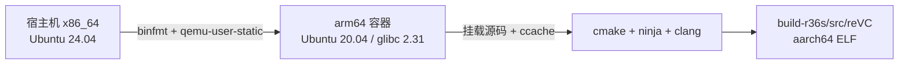

# 02 - 编译环境搭建指南

> 状态：**已在本机打通（2026-09-27）**。本文记录最终方案、实测结果和踩过的坑，后续执行者可以直接照做。
> 背景：[docs/01](01-R36S罪恶都市移植与优化设计方案.md) §4.2 方案 A，用 Docker 加 qemu 跑 arm64 的 Ubuntu 20.04 容器，在容器里原生编译。

---

## 1. 方案



| 文件 | 作用 |
|---|---|
| `PortMaster/re3-sdl/tools/r36s/Dockerfile` | 构建镜像：`arm64v8/ubuntu:20.04` 加 reVC 依赖 |
| `PortMaster/re3-sdl/tools/r36s/build.sh` | 在容器里以当前用户身份执行 cmake 和 ninja |
| `PortMaster/re3-sdl/tools/r36s/README.md` | 快速上手 |
| `.gitignore` | 加入 `build-r36s/` |

**与原计划的偏差**：没有用官方镜像 `portmaster-builder:aarch64-latest`，原因有两个：
- 它有 1.5GB，本机从 ghcr.io 拉只有几十 KB/s 到 200KB/s，还会中途断流（unexpected EOF）；
- daocloud 的 ghcr 镜像站不在白名单里，返回 403。

改用官方镜像的**同一个基础镜像** `arm64v8/ubuntu:20.04`，只装 reVC 需要的包。glibc 版本和官方一致，兼容性结论不变。

---

## 2. 一次性准备（本机已完成）

```bash
sudo apt install -y docker.io qemu-user-static
sudo usermod -aG docker "$USER"          # 需要重新登录；在此之前可以用 sg docker -c '...'
cat /proc/sys/fs/binfmt_misc/qemu-aarch64 # flags 里要有 F
```

构建镜像，约 6 分钟：

```bash
cd PortMaster/re3-sdl
docker build --platform linux/arm64 -t revc-r36s-builder:focal tools/r36s
```

Dockerfile 的关键点：
- **基础镜像**：从 `docker.m.daocloud.io/arm64v8/ubuntu:20.04` 拉取。
- **apt 源**：换成 `mirrors.aliyun.com/ubuntu-ports`，速度约 1.2MB/s。两者都可以用 `--build-arg BASE=... APT_MIRROR=...` 覆盖。
- **包**：`clang cmake ninja-build ccache libsdl2-dev(2.0.10) libopenal-dev libmpg123-dev libegl1-mesa-dev libgles2-mesa-dev`。

---

## 3. 编译

```bash
git submodule update --init --recursive   # vendor/librw 必须停在 81c9426
tools/r36s/build.sh                        # 或 RelWithDebInfo
```

cmake 参数与 nosro README 一致。另外加了三处：
- `Ninja` 和 `ccache`；
- 关掉 librw 的 tools 和 install；
- **`-Wl,--as-needed`**，原因见 §4.2。

---

## 4. 实测结果

### 4.1 耗时（16 核）

| 场景 | 耗时 |
|---|---|
| 首次全量编译（qemu，311 个目标） | **411s** |
| 删掉 build 目录后重编（ccache 已热） | 18s |
| 改一个 `.cpp` 后增量编译 | 3s |

qemu 下的迭代速度已经够用，**暂时不需要**做 docs/01 里的方案 C（宿主机交叉编译）。

### 4.2 产物检查

```
build-r36s/src/reVC: ELF 64-bit LSB executable, ARM aarch64, 4.2M, not stripped
最高 GLIBC_2.29（≤ 2.31 ✓）  最高 GLIBCXX_3.4.22
NEEDED: libopenal.so.1 libm.so.6 libSDL2-2.0.so.0 libpthread.so.0
        libmpg123.so.0 libstdc++.so.6 libgcc_s.so.1 libc.so.6
```

- **libOpenGL.so.0 已去掉**。
  - 原因：librw 的 CMake 优先用 GLVND，默认会链接 `libOpenGL.so.0`。但 dArkOS 上的 GL 由 libMali 提供，`mod_dArkOS.txt` 只软链了 EGL、GLES 和 gbm，没有 libOpenGL，所以运行时会找不到这个库。
  - 为什么能直接去掉：reVC 实际上通过 glad 加 `SDL_GL_GetProcAddress` 在运行时加载 GL 函数，二进制里没有任何未解析的 `gl*`/`egl*` 符号（已用 `nm -D` 核实）。
  - 做法：加 `--as-needed` 后，链接器会自动丢掉这个用不上的依赖。librw 的 CMake 没有改。
- **需要随包附带**：`libopenal.so.1` 和 `libmpg123.so.0`，从镜像里拷出来。SDL2 用设备自带的。
- **冒烟测试**：在容器里用 `SDL_VIDEODRIVER=dummy` 运行。库全部能解析，进程能启动并创建 `userfiles/`，然后因为没有游戏数据和显示设备而 segfault，这是预期的。真正的运行验证要在 R36S 上做。

### 4.3 验收

| # | 项 | 结果 |
|---|---|---|
| 1 | arm64 容器 | ✅ `aarch64`，glibc 2.31 |
| 2 | 可复现 | ✅ 删掉 build 目录后能从零编出来 |
| 3 | 架构 | ✅ ARM aarch64 |
| 4 | glibc ≤ 2.31 | ✅ 2.29 |
| 5 | 没有 GLFW、X11、libOpenGL | ✅ |
| 6 | 源码干净 | ✅ 只多了 `tools/r36s/` 和 `.gitignore` |
| 7 | 增量编译 | ✅ 3s |

---

## 5. 本机环境踩坑记录

### 5.1 docker.sock 权限

用户已经在 docker 组里，但当前登录会话是加组之前开的，所以没有生效。**重新登录一次**就好；临时可以用 `sg docker -c '...'`。

### 5.2 DNS（宿主机 VPN 客户端的本地代理）

`/etc/resolv.conf` 指向 `127.0.0.1`——本机 VPN 客户端的 DNS 代理。它回的包格式有问题（dig 会报 malformed），glibc 和 dockerd 解析都会随机失败，报 `lookup ... on 127.0.0.1:53: no such host`。

**规避方法**：在 `/etc/hosts` 里写死拉镜像要用的几个域名（`ghcr.io`、`pkg-containers.githubusercontent.com`、`docker.m.daocloud.io`），原文件先备份。

注意：
- 写死的 IP 以后可能会变。拉镜像又报解析或连接失败时，用系统 DNS 查出新 IP 替换进去。
- 退出 VPN 以后，可以删掉这几行。
- apt 源（aliyun）是在容器里解析的，走 `daemon.json` 里单独配置的 `dns`，不受 VPN 代理影响。

### 5.3 不要用 systemd 的 BindReadOnlyPaths 覆盖 dockerd 的 resolv.conf

试过给 docker.service 加 drop-in：`BindReadOnlyPaths=/etc/docker/resolv.conf:/etc/resolv.conf`。

- 结果：**所有容器都启动不了**，报 `exec: "xxx": no such file`，连 amd64 的 busybox 也不行。
- 原因：它改动了 dockerd 所在的 mount 命名空间，容器 rootfs 的挂载因此出了问题。
- 已回滚：drop-in 删了，`daemon.json` 恢复成原样。**不要再用这个办法**，换成 §5.2 的 `/etc/hosts`。

### 5.4 本机对当前配置的改动清单

| 改动 | 撤销方法 |
|---|---|
| 用户加入 docker 组（之前就已经在组里） | `sudo gpasswd -d $USER docker` |
| `/etc/hosts` 追加 3 行 | 从 `/etc/hosts.bak-docker` 恢复，或手动删除 |
| 本地镜像 `revc-r36s-builder:focal`，以及 `arm64v8/ubuntu:20.04` | `docker rmi ...` |
| ccache 目录 `~/.cache/revc-ccache` | 直接删除 |

---

## 6. 下一步（P0c/P0d）

- 写打包脚本：组装 `gtavc/`，包括 `reVC.aarch64`、`libs.aarch64/{libopenal.so.1,libmpg123.so.0}`、`reVC-data/`，以及新写的启动脚本。
- 上机验证：从 EmulationStation 启动，能进游戏、能存档和读档、手柄和声音都正常，再采三个场景的基线帧率。
- 上机时要确认两点：
  - 设备上 SDL2 的实际版本和 KMSDRM 能不能用；
  - `libEGL`/`libGLESv2` 是否已经软链到了 `libMali.so`。
