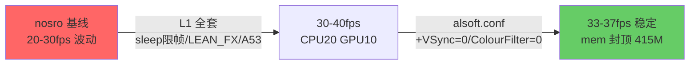
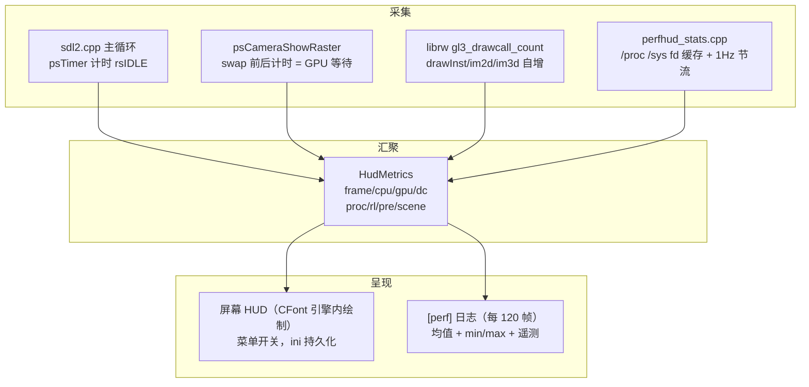
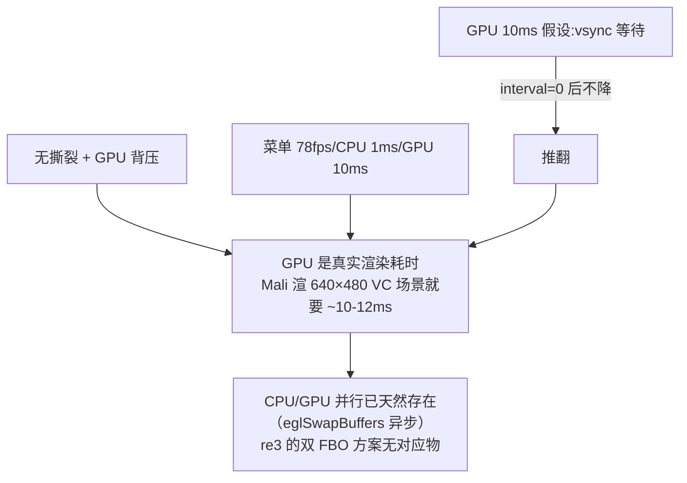
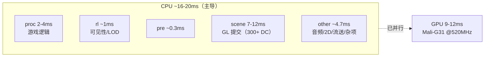

# 03 - 性能优化首战复盘（2026-09-27）

> 范围：P0（构建 → 部署 → 运行）全部完成；P1/P2（性能）第一阶段收官。
> 结果：压力场景 **20-30fps（波动）→ 33-37fps（稳定），+40%**；观测体系（HUD + 周期日志）建立；两条负结果路径被数据排除。
> 分支：`re3-sdl` `r36s`（8 个提交）、`vendor/librw` `r36s`（3 个提交）。
> 前置文档：[01 设计方案](01-R36S罪恶都市移植与优化设计方案.md)（预测）、[02 编译环境](02-编译环境搭建指南.md)。

---

## 1. 结果总览

| 阶段 | 压力场景 FPS | CPU / GPU | 说明 |
|---|---|---|---|
| nosro 基线 | 20-30 波动 | 约对半 | 忙等限帧 + 全特效 |
| L1 优化版 | 30-40 | 20ms / 10ms | sleep 限帧、LEAN_FX、A53 codegen 等全开 |
| 当前（+音频调优） | **33-37 稳定**（15 窗口均值 36.1） | ~16-20 / 9-12 | alsoft.conf + 车辆音效回归修复 |

当前完整配置（`reVC.ini`）：`FrameLimiter=0`、`VSync=0`、`ColourFilter=0`、`NewRenderer=0`、`PS2AlphaTest=1`、`[Perf] PerfHud=1`。

---

## 2. 观测体系：先建仪表盘，再踩油门

所有优化决策都由数据驱动，观测体系是本轮最大的基础设施收益。

- **HUD**：屏幕左中部，`FPS/CPU/GPU/DC/SYS/MEM/频率/温度` 八行；Display Settings 里的 PERF HUD 开关绑定 `gPerfHudEnabled`（CFO 机制，持久化到 `reVC.ini [Perf]`）。
- **日志**：`log.txt` 每 120 帧一行窗口均值，含 `proc/rl/pre/scene/other` 五段 CPU 拆解、min/max 帧时间（卡顿尖峰可见）。
- **GDB**：设备上 `gdb -p` 附加运行中的进程查全局变量（`gPerfGpuMs`/`sNumLines` 等），静态成员需 `nm` 找地址或用 `(char)Class::member` 语法。本轮用它定位了 HUD 数据管线断链（见 §6.1）。

---

## 3. 生效的优化（设计方案 P1-P9 逐项结算）

| # | 优化 | 状态 | 实测归因 |
|---|---|---|---|
| P1 | 限帧忙等 → `SDL_Delay` sleep | ✅ | 波动收窄、SYS% 下降；配合 `FrameLimiter=0` 全速 |
| P2/P3 | `REVC_LEAN_FX` 去 SCREEN_DROPLETS + `ColourFilter=0` | ✅ | 每帧两次全屏拷贝消失（GPU 侧收益并入总量） |
| P4 | SwapInterval 缓存（值变化才调用） | ✅ | 小；顺带打了 `[swapinterval] want/rc` 协商日志 |
| P5 | LOD 菜单下限 0.925 → 0.5 | ✅ | 下限放开，默认值未动（待温控轮再评估默认降档） |
| P6 | RGB565 + D16 请求 | ❌ | **Mali blob KMSDRM 不给 565**：实测拿到 `R8G8B8 D24`。代码保留（env 可关），此路不通 |
| P7 | A53 codegen：`-mcpu=cortex-a53 -fno-math-errno -fno-trapping-math -ffunction-sections -fdata-sections -Wl,--gc-sections`（reVC + librw 双目标） | ✅ | 二进制 4.29M→4.07M（段回收）；clang 对 A53 主动避免 FMA（分立 fmul+fadd 反而更快），指令分布验证 codegen 生效 |
| P8 | `REVC_R36S` undef DEBUGMENU/TIMEBARS/CHATTYSPLASH | ✅ | 发布形态；注意 `debugmenu.h` 补了空 TWEAK 宏才能编过 |
| P9 | `while(SDL_PollEvent)` 事件批处理 | ✅ | 输入延迟（未单独量化） |
| — | 音频 `alsoft.conf`（22050/512/2/linear/rt-prio=0/64 sources/hrtf off） | ✅ | `other` 段 5-7ms → **4.7ms**；见 §6.4 的回归与修复 |

---

## 4. 负结果实验（数据排除，同样重要）

### 4.1 NEW_RENDERER（leeds 风格渲染）——净负优化，弃

| 指标 | 经典渲染器 | NewRenderer | 判定 |
|---|---|---|---|
| scene 段（CPU 提交） | 10ms | **3.5-4.5ms** | ✅ -60% |
| GPU | 10ms | **14.6-15.8ms（升频 520MHz）** | ❌ +50% |
| FPS | 36 | 30-32 | ❌ 净负 |

结论：leeds 路径的绘制顺序对 Mali 的 early-Z/overdraw 不友好，GPU 成为硬瓶颈后 CPU 省下的全被吃掉。**设计方案 §2.4 的"NEW_RENDERER 在 Mali 上的代价待实测"就此结案：R36S 用经典渲染器。**

### 4.2 PS2AlphaTest=0（去 alpha 双 pass）——无收益，弃

繁忙街道 DC 260→443（爬升来自实体密度变化，非开关效果），FPS 持平略降，且半透明边缘有深度瑕疵风险。双 pass 在该场景占比小，不值得为它冒视觉风险。

### 4.3 VSync=0——驱动接受，但不是瓶颈

`[swapinterval] want=0 rc=0` 证明 Mali 接受了 interval=0，**但 GPU 时间纹丝不动（10→12.5ms）、无撕裂**。推论链：

这轮推翻了「vsync 等待占 GPU 大头」的假设，把矛头正确指向 draw call 提交路径。

---

## 5. 瓶颈模型（当前）

- CPU 主导；**scene（draw call 提交）和 other 是两个主攻方向**。
- 内存：流送缓存在 ~415M 封顶（前段爬升 348→411M 不是泄漏，观察 15+ 窗口已平稳）。
- 温度：均值 78.3℃ / 峰值 80.4℃，GPU 满频运转；出现过一次 `a=1200M` 偶发降频。**温控是长会话的硬约束。**

---

## 6. 踩坑记录（技术债清偿）

### 6.1 HUD 数据管线断链（GDB 定位）

现象：菜单能开 PERF HUD 但屏幕不显示。GDB 显示 `sNumLines=0, sStats=NULL`，而 `gPerfGpuMs=11.5ms, gPerfDrawCalls=262` 有活数据——`Hud_Update` 从未被调用。根因：计时和 Update 挂在了 `!m_PrefsFrameLimiter` 分支里，而设备默认 `FrameLimiter=1` 走另一条路。修复：提到分支外，两条路径都喂。

### 6.2 ini 的三个坑

1. **大小写敏感**：代码读 `VSync`（大写 S），ini 里写 `Vsync` 无效（mini.ini `MINI_CASE_SENSITIVE`）。
2. **游戏退出时重写键**：退出会把当前设置追加到节尾，形成同名重复键，后者覆盖前者——手改的值被静默吞掉。处理：改完去重。
3. **m_PrefsVsync 的同步时机**：`Disp → 实际值` 只在新游戏/读档/菜单 RESUME 三处同步。

### 6.3 alsoft 文件名

OpenAL 在 CWD 找的是 **`alsoft.conf`**，不是 `alsoft.ini`。用 `ALSOFT_LOGLEVEL=3` 启动可看到完整解析链（搜索路径列表 + 每个键的 setting/Found 记录），是验证配置生效的正规手段。

### 6.4 音频回归：车辆声音消失（当天修复）

`resampler = point`（最近邻）在 **pitch 调制音源**上混叠严重——VC 的车辆引擎声靠每帧改写 source 频率实现 RPM 变调，最近邻重采样直接把它弄哑了；`sources = 32` 也不够繁忙街道的瞬时并发（超出被静默丢弃）。修复：`linear` + `64 sources`，性能零回退（other 段维持 4.7ms）。

**教训：音频参数调优必须带「变调音源」回归测试（车辆/警笛），静态音效听不出来。**

### 6.5 SSH 直跑游戏的环境

SSH 里直接跑 reVC 需要 `SDL_VIDEODRIVER=kmsdrm SDL_VIDEO_EGL_DRIVER=libEGL.so SDL_VIDEO_GL_DRIVER=libGLESv2.so`（ES 启动环境里由系统注入）。缺 EGL_DRIVER 时报 `Can't load EGL/GL library`。SSH 会与 ES 抢 KMSDRM，冒烟测试别在 ES 占屏时做。

### 6.6 GXT 追加键的格式要点

VC GXT：`TABL`（`8s 表名 + u32 绝对偏移` × N）→ 各表 `TKEY`（**必须按键名排序**，引擎 BinarySearch 依赖）+ `TDAT`。`tools/gxt_add_keys.py` 已实现读改写 + 重排序，6 语言全量应用（`FED_PRF = PERF HUD`）。

### 6.7 Mali/EGL 其他事实

- KMSDRM 下 `SDL_GL_SetSwapInterval` 返回 0（接受），但 565 config 不给（P6 结案依据）。
- qemu 容器里编出的二进制在宿主机 `objdump` 报 `architecture UNKNOWN`——用 builder 容器内的 binutils 验证指令分布。

---

## 7. 遗留问题（按优先级）

| # | 问题 | 数据 | 拟议 |
|---|---|---|---|
| 1 | 温控 | 峰值 80.4℃，出现过一次 1200MHz 偶发降频 | governor 策略（performance vs conservative）+ LOD 默认降档；启动脚本注入 |
| 2 | 卡顿尖峰 | `[perf]` max 反复 80-150ms，偶发 470ms+ | 流送优先级 / IO；先抓尖峰时刻的 proc 场景相关性 |
| 3 | other 段细分 | 4.7ms 黑盒 | 音频已排除大头，剩 2D/流送/事件；需要时再拆 |
| 4 | 中文本地化 P3 | — | 独立轨道，见设计方案 §6 |

---

## 8. 提交索引

`PortMaster/re3-sdl`（分支 `r36s`，基于 nosro `miami-sdl2` b9f0b234）：

| 提交 | 内容 |
|---|---|
| `9c6e8cc6` | 构建脚本 + Docker builder（tools/r36s/） |
| `deb9eac1` | L1 性能优化（P1-P9） |
| `586f8d53` | Perf HUD 移植 + 菜单开关（CFO + GXT FED_PRF） |
| `be51eba9` | submodule 指针跟进 |
| `7d91258b` | HUD 帧率限制器分支修复；菜单唯一控制 |
| `6ea991ae` | A53 codegen（P7）+ Idle 阶段计时 |
| `bf6d5cb0` | 阶段数据从 HUD 移到 [perf] 日志 |
| `91526b8f` | alsoft.conf 音频调优 |
| `bb33fed8` | 车辆音效修复（linear/64）+ HUD 去背景 |

`vendor/librw`（分支 `r36s`，基于 nosro `81c9426`）：

| 提交 | 内容 |
|---|---|
| `fa4346c` | SwapInterval 缓存 + RGB565 请求（含协商日志）+ EGL config 回显 |
| `0d1b426` | draw call 计数器（drawInst_simple + im2d/im3d 4 点） |
| `d1a593f` | A53 codegen flags |

设备侧产物（`/roms/ports/gtavc/`）：`reVC`（当前版）、`reVC-original` / `reVC.nosro.bak`（基线备份）、`alsoft.conf`、`TEXT/*.gxt`（含 FED_PRF）。

---

## 附录：硬件基准（同日实测，供横向参考）

| 项 | 值 |
|---|---|
| CoreMark 单线程 / 4 线程 | 2864 / 9888 CoreMark/s（GCC12 -O2，@1296MHz ondemand） |
| 内存带宽（优化实现） | memcpy 1333 MB/s / memset 4496 MB/s（16MB 缓冲，DDR3 级） |
| L1 缓存内 | memcpy 4156 / memset 10146 MB/s |
| Wi-Fi（TCP） | 上行 4.19 / 下行 9.44 Mbit/s（2.4GHz ch6，-62dBm，链路饱和） |
| GPU | Mali-G31（Bifrost）GLES 3.2 v1.r13p0，devfreq 520MHz 运行 |
