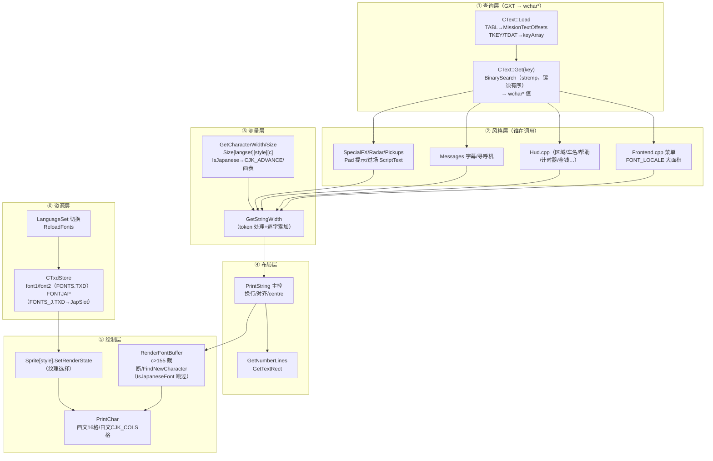
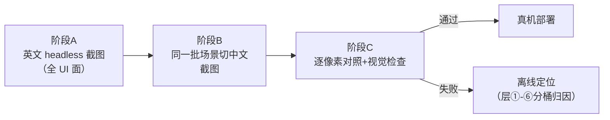
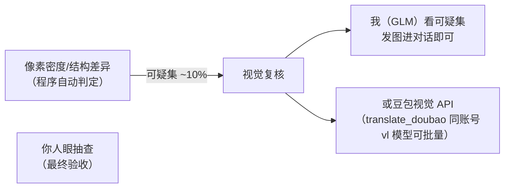

# 04 - 文字渲染链路与单元测试方案

> 状态：方案 v1.0（2026-09-28）
> 背景：CJK 管线在真机上经历三轮"盲改-部署-回归"后回退（`8db32f38`）。本方案先离线验证再上真机，杜绝回归。
> 前置文档：[01 设计方案 §6](01-R36S罪恶都市移植与优化设计方案.md)、[03 复盘 §6 踩坑](03-性能优化首战复盘-2026-09-27.md)。

---

## 1. 渲染链路全景（代码级）

游戏里**每一个可见文字**都走这条链（25 个文件、1201 处 `TheText.Get` / 359 处 `PrintString`）：



### 各层的已知炸点（历史回归实录）

| 层 | 炸点 | 历史教训 |
|---|---|---|
| ① | TKEY 乱序 / 任务表格式错 | gxt_add_keys 轮：排序必须 strcmp 序 |
| ② | FONT_LOCALE 覆盖面（371 菜单键） | 金钱/计时器**不能**包（GTA3 `1dcbf20d`） |
| ③ | **Size[] 维度/初始化器**（slot 2/3 全零→零宽堆叠）| `d6f98823` 轮：静态数组维度改动必须全量审 |
| ④ | CJK_LINEH 换行高 | 激活 `#if 0` 死代码段时吃掉保护指令 |
| ⑤ | c>155 截断 / style 判断 | `IsJapaneseFont()` 条件分支覆盖 |
| ⑥ | **同槽 LoadTxd 覆盖**（FONTS_J 替换主槽→西文全灭）| `eccbe72e` 轮 |

**当前真机状态（回退基线）**：过场台词完美、菜单有少量中文、部分菜单空白、HUD 排版乱——问题集中在 ②③ 层的组合。

---

## 2. 测试策略：英文基线 → 中文对照



**核心思想**：英文模式是**已验证的黄金参照**（nosro 基线跑了多日）。同代码路径下切中文，任何差异都能归因到 CJK 分支，而不是渲染管线本身。

---

## 3. 三层测试工具（tools/l10n/test/）

### 3.1 数据一致性测试（`test_gxt.py`）——不碰渲染

对生成产物做全量断言，秒级完成：

```text
T1  GXT 结构：TABL 顺序、每表 TKEY strcmp 有序、TDAT offset 不越界
T2  码位覆盖：每个值的非控制码位 ∈ [0x20, 0x20+atlas_cells)，且该 cell 有字形
T3  控制符守恒：逐键多重集比对（源 vs GXT 回读），~token 逐字符 0x8000 标志
T4  图集完备：cn_charmap.json 的 cell ↔ PNG 实际渲染区域（非空像素）一致
T5  键完备：4758 键一个不少，MAIN/任务表归属正确
```

### 3.2 测量/布局模型测试（`test_layout.py`）——Python 参照实现

把 C++ 的 `GetCharacterWidth/Size`、`GetStringWidth`、换行逻辑**提取成 Python 参照模型**（与源码逐行对齐），然后：

```text
T6  Size 表快照：从 Font.cpp 解析初始化器 → 断言 [4][4][210] 每格非零（slot 2/3 修复的回归测试）
T7  宽度函数：随机 ASCII/中文/混合/token 串，参照模型与 C++ 语义一致
      - 断言：中文字符宽度恒为 CJK_ADVANCE*scale，ASCII 用西表，token 不计宽
T8  行宽边界：构造恰好超宽/恰好不超宽的串，验证换行点
```

**这一层能 100% 离线抓住上一轮的 Size[] 全零 bug**——当初差的就是它。

### 3.3 渲染快照测试（`test_render.sh` + `shot.c`）——headless 真渲染

用 **SDL dummy + EGL surfaceless**（librw 已支持，容器里就能跑）驱动真实渲染管线：

```text
环境：builder 容器内（qemu arm64）
     SDL_VIDEODRIVER=dummy + EGL_PLATFORM=surfaceless
     （librw gl3 有 GBM/surfaceless 后端；不行则 headless X + llvmpipe）

T9  英文基线截图：
     固定场景脚本（debug 菜单直达/USE_DEBUG_SCRIPT_LOADER 的 main_d.scm）
     → RwGrabScreen 逐帧存 PNG → 英文基准库（~30 张）

T10 中文对照截图：
     同场景、LanguageSet=JAPANESE + JAPANESE.GXT/FONTS_J
     → 同名 PNG → 与基准逐像素 diff

T11 差异分析（自动 + 视觉双轨）：
     a) 程序判定：文本区域像素密度对比（空文本=像素密度骤降=空白 bug）
     b) 视觉判定：diff 图交给人/多模态模型复核
```

---

## 4. 视觉检查的分工（回答"GLM 支持视觉吗"）

我**可以**处理图像输入（截图可以发我看）。但快照测试会产生几百张图，逐张发对话不现实，分工如下：



- **第一道**：程序化（密度/布局不变量）筛掉 90%——**不依赖任何视觉模型**
- **第二道**：可疑集发给我看（少量图直接贴对话），或接豆包 `doubao-vision` API 批量跑（工具里已有 Ark SDK 基础设施）
- **最终**：你上真机验收

---

## 5. 执行顺序

| 步骤 | 内容 | 产出 | 预计 |
|---|---|---|---|
| 1 | `test_gxt.py`（T1-T5） | 现有 GXT 全绿或定位 | 0.5h |
| 2 | `test_layout.py`（T6-T8） | Size 表 + 宽度模型 | 1.5h |
| 3 | headless 渲染环境验证 | 容器内能出英文截图 | 1h |
| 4 | 英文基准库（T9） | ~30 张基准 PNG | 1h |
| 5 | 中文对照 + diff（T10/T11） | 差异报告 | 1h |
| 6 | 修复 → 重跑 2-5 循环 | 直到 diff 干净 | — |
| 7 | 真机部署验收 | 用户确认 | — |

步骤 1-2 **不碰真机、不碰 C++**（纯 Python 断言），完成后就能判断现有产物的健康状况；步骤 3 是关键未知数（headless EGL 是否可行），不行就退化到"真机截图 + 拉回本地对比"（牺牲自动化，保留对照法）。

---

## 6. 附加收益

- T6 是 `Size[]` 维度改动的**永久回归闸**（这次的坑永不再踩）
- 英文基准库今后任何渲染改动（字体/LOD/HUD）都能一键对照
- 中文翻译质量抽查可以复用 T10 的截图（顺带校对译文）
