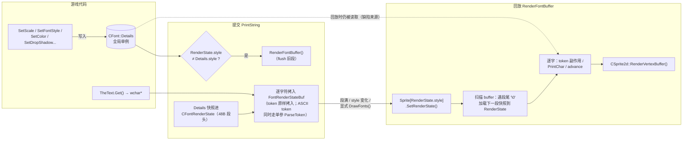
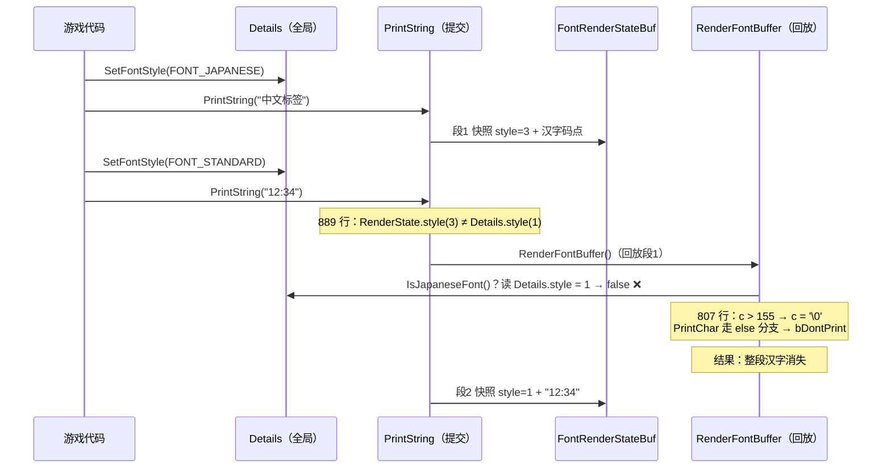
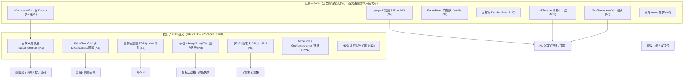
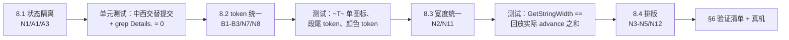

# 05 - 文字渲染管线架构分析：Details/RenderState 双状态模型缺陷

> 状态：分析完成（v2，已逐行对照代码复核），待定方案
> 基线：`92bcace3`（菜单偶数串修复、hang 修复、图标空白修复均已部署）。HEAD `966d7eec` 之前 Font 代码没有变化
> 行号均指 HEAD 的 `src/renderer/Font.cpp`，另有注明的除外。上游对照：`re3-VC`（miami，`a16fcd8d`）
>
> **v2 修订说明**：v1 的方向（回放阶段读取了提交阶段的全局状态）是对的，但部分证据和结论有误，本版已直接改正，改动处标 **【v2 更正】**。§7 是新增的深入分析，包括 v1 漏掉的几个更直接的根因。§8 是修订后的方案，取代 v1 的 §5。

结论先行：**当前所有视觉 bug（字体变细或阴影消失、出现两个 Y、HUD 排版乱）都有一个共同的根因：回放阶段读的是“当前全局状态 Details”，而不是“提交时的快照 RenderState”。**
- 双状态模型本身来自上游。上游跑得通，是因为它的西文回放路径基本只读快照；而读 Details 的那些日文分支，在上游是从未执行过的死代码。
- 我们的中文管线复活并扩展了这些分支，于是问题从“潜伏”变成“必现”。
- 在这个前提下打补丁收敛不了，需要按 §8 的原则整改。

---

## 1. 管线全貌

reVC 的文字渲染分两段：**提交（Submit）→ 回放（Replay）**，中间是一块共享的扁平缓冲区。



关键数据结构：

| 变量 | 类型 | 生命周期 | 设计意图 |
|---|---|---|---|
| `CFont::Details` | `CFontDetails`（全局单例） | “当前设置”，跨帧保留 | 游戏代码的状态机，只该在提交路径读取 |
| `CFontRenderState` | 逐段快照，48 字节（Font.h:46-62） | 随 buffer 存活 | 回放时还原提交时的状态 |
| `CFont::RenderState` | `CFontRenderState`（全局单例） | 正在回放的那一段 | 回放上下文 |
| `FontRenderStateBuf` | 1024 字节扁平字节流（297 行） | 到下一次 flush 为止 | 段头和字符交错存放 |

**【v2 更正】快照里实际有的字段**（PrintString 914-927 行）：`fTextPosX/Y`、`scaleX/Y`、`color`、`fExtraSpace`、`slant`、`slantRefX/Y`、`bFontHalfTexture`、`proportional`、`style`、`bIsShadow`。
- `anonymous_0` 和 `anonymous_14` 从来不写，内容是残留值。
- **快照里没有** `dropShadowPosition`、`dropColor`、`bFlash`、`bBold`、`centre`、`wrapX`。

**【v2 更正】flush 有三个时机**，v1 只写了第一个：
1. 889 行：style 变化，`if (RenderState.style != Details.style) { RenderFontBuffer(); RenderState.style = Details.style; }`
2. 912 行：buffer 快满。
3. 1969 行的 `DrawFonts()`，有几十处显式调用：main.cpp 728/750/1487/1525/1758、Hud.cpp 1211/1317/1382、Frontend.cpp 2522/2540/3328/5466、FrontEndControls.cpp 等。

由第 1 条可以推出两个性质，这是理解 §7 N1 的关键：
- **同一个 buffer 里所有段的 style 必定相同**，所以回放时 `RenderState.style` 就是本批次唯一的 style。
- **因 style 变化触发 flush 时，`Details.style` 一定已经是“下一段”的新 style，和 buffer 里的内容不一样。**

## 2. 实测证据（GDB，在 PC 上本地复现）

### 2.1 性能显示变细、后几个字阴影消失：scale 竞态确认

GDB 在 `PrintChar` 设条件断点：`Details.style != RenderState.style || Details.scaleX != RenderState.scaleX`

```
MISMATCH#1 D.style=3 R.style=3 D.sx=0.900 R.sx=1.500 x=1141.5 y=27.3
MISMATCH#2 D.style=3 R.style=3 D.sx=0.900 R.sx=1.500 x=1177.5 y=27.3
MISMATCH#3 D.style=3 R.style=3 D.sx=0.900 R.sx=1.500 x=1213.5 y=27.3
（主菜单标题“主菜单”，命中 24 次，D.sx=0.9 vs R.sx=1.5）
```

**解读**：
- 标题“主菜单”提交时 scale=1.5，快照是对的。
- 回放到 `PrintChar` 时，全局 `Details.scaleX` 已经被**下一项**（菜单条目，scale=0.9）改掉了。
- 两边 style 都是 3，说明这次 flush 来自 `DrawFonts()` 或 buffer 满，不是 style 变化（style 变化触发的 flush 两边必然不同，见 §1）。【v2 补充】

PrintChar 的 CJK 分支（610-636 行，已核实）：

```cpp
if (Details.dropShadowPosition != 0) {                 // 616：阴影开关读全局
    CSprite2d::AddToBuffer(CRect(x + SCREEN_SCALE_X(Details.dropShadowPosition), ...,
        ... + CJK_DRAWW * Details.scaleX, ... + CJK_DRAWH * Details.scaleY),
        Details.dropColor, ...);                         // 622：阴影颜色读全局
}
CSprite2d::AddToBuffer(CRect(x, y,
    x + CJK_DRAWW * Details.scaleX,                      // 630：几何读全局
    y + CJK_DRAWH * Details.scaleY),                     // 631
    RenderState.color, ...);                             // 632：颜色却读快照
```

同一次绘制里，几何按 0.9 算，颜色和 advance 按 1.5 那一段的快照来。这能解释：
- **变细**：CJK 字形 quad 的宽度按 0.9 算，而字距 advance 用的是快照里的 1.5（831 行 `textPosX += RenderState.scaleX * GetCharacterWidth(c)`）。结果是字窄、间距宽，看起来发虚。
- **阴影消失**：CJK 的阴影 quad 在 PrintChar 里逐字绘制，开关读的是 `Details.dropShadowPosition`。回放时这个值往往已经被下一个提交者清零。
  - 【v2 更正】同一次 flush 里 Details 是常量，所以阴影一般是整批有、或整批没有。只有 912 行因 buffer 满在中途 flush 时，才会出现“后几个字”不一样。v1 说的“逐字抖动”并不成立。
- **动画期间正常、稳定后变细**：未验证，属于推测。可能的机制是：动画期间每帧的提交顺序和 `DrawFonts()` 插入点不同，导致 flush 那一刻 Details 的最后取值不同。

### 2.2 出现两个 Y：token 被多处消费

`(Y)` 图标的链路：
1. GXT 里存的是 `~k~~VEHICLE_ENTER_EXIT~`，每个字符都带 0x8000 标志。
2. `CMessages::InsertPlayerControlKeysInString`（Messages.cpp:458 匹配带标志的 `~k~`）在**入队前**把键名替换成 `~T~`。
3. 这个 `~T~` 是**纯 ASCII**，经由 `GetWideStringOfCommandKeys` → `AsciiToUnicode(Buttons[...])` 生成，按键表在 **ControllerConfig.cpp:2711 的 `XboxButtons`**。
   - 【v2 更正】v1 说“来自 Messages.cpp”不对。另外，只有在 `DETECT_PAD_INPUT_SWITCH` 打开、处于手柄模式、并且 `ButtonsSlot != -1` 时才会生成 `~T~`，否则生成的是键名文本。
4. 最终的串里混着“带标志的 token”和“ASCII token”。

消费点有三处，互相不知道对方的存在：

| # | 位置 | 时机 | 对 `~T~`（ASCII） | 对带标志的 token |
|---|---|---|---|---|
| 1 | `PrintString` 提交循环（930-944） | 写入 buffer 时 | 调单参 `ParseToken(s)`，副作用是设置 PS2Symbol、NewLine、Details.color，然后把 token 原样拷入 | 只判断 `'~'`，**整个 token 被当成普通字符拷入** |
| 2 | `RenderFontBuffer` 回放循环（709-778） | 从 buffer 读出时 | 四参 `ParseToken`（760），再来一次副作用，然后 `DrawButton` | 92bcace3 加的手动消费分支（714-758） |
| 3 | `GetStringWidth`（1520-1549）/ `GetNextSpace`（1631-1640） | 测量排版时 | 各自跳过 token 计算宽度 | 与 1、2 的逻辑不一致 |

【v2 更正】v1 表里的“845-875 行”位于 `#if 0` 死代码块中，不是实际生效的代码。

**两个 Y 的真正原因**【v2 更正，v1 的三条原因里有两条是错的】：
- ❌ v1 说“阴影 pass 画了第二个 Y”：不成立。
  - 894 行的阴影递归只对 `FONT_BANK/FONT_STANDARD` 生效。
  - 帮助框用的是 `FONT_LOCALE(FONT_STANDARD)`，也就是 style 3，而且 Hud.cpp:1329 设了 `SetDropShadowPosition(0)`。
  - CJK 的阴影在 PrintChar 里画，从不调用 DrawButton。
- ❌ v1 说“PS2Symbol 没人清”：不准确。516 行（InitPerFrame）和 765 行（DrawButton 之后）都会清。
- ✅ 真正的原因：**上游在回放时解析每个 token 之前都会先清一次 `PS2Symbol = BUTTON_NONE;`**（上游 675 行，我们 `#else` 分支的 781 行也保留着），但 **92bcace3 新写的 `MORE_LANGUAGES` 分支（709-778）把这一行删掉了。** 于是：
  1. 提交阶段 932 行的单参 ParseToken 把 PS2Symbol 置成 TRIANGLE；
  2. 回放时遇到的**第一个任意 token**（比如带标志的 `~h~`，它走 switch 的 default，不修改 PS2Symbol）就把这个残留值画出来，这是第 1 个 Y；
  3. 之后回放到真正的 `~T~`，又画一次，这是第 2 个 Y。

**图标后面间距过大**【v2 更正，v1 把 off-by-one 的方向说反了】：
- 四参 ParseToken（1766-1769 行 `while (*s != '~') ++s; if (*(++s) == '~') ...; return s;`）返回的是**闭合 `~` 之后**的位置。循环体在同一轮里接着把这个字符画出来（802 行），所以 ASCII 分支**不会丢字**。
- 真正的错误在 92bcace3 的手动分支：757-758 行 `if (closed) pRenderStateBufPointer.pStr--;` 把指针退回到闭合符（0x807E）上。802 行随即把它当成字形处理：
  - `c = 0x805E`，807 行 CJK 模式不做截断；
  - 宽度取 `CJK_ADVANCE`=24；
  - UV 的 yoff 算出来是 513，远远超出图集。
- 结果是多出一个 24×scaleX 的空白格或杂点。注释里写的“for 循环的 ++ 会吃掉下一个字”，这个前提并不成立。

### 2.3 HUD 排版乱

- `GetCharacterWidth`（1409-1447）在同一个函数里混用了两种状态：
  - 1413 行判断 `!RenderState.proportional`，1414 行却返回 `Size[0][Details.style][192]`；
  - 1415 行 `Details.style == FONT_HEADING || RenderState.style == FONT_BANK`，其中前半句永远为假，因为 SetFontStyle（2106-2114）总会把 HEADING 映射成 STANDARD 加上半纹理。
- 【v2 更正】`GetCharacterSize`（1450-1500）**只读 Details**，放在提交阶段看是自洽的。v1 说它也混用，不对。
- 【v2 更正】v1 说“ASCII 数字去查了 3 号字体的西文宽度表，和纹理对不上”：不对。style 3 查的是 `Size_jp[c]`（1419 行）；回放时 `RenderState.style` 和当前绑定的 Sprite 本来就一致。
- 【v2 更正】`IsJapaneseFont()` 读的是 `Details.style`（Font.h:243，这是上游的原始定义）。它的后果不是“数字走了 CJK 几何、变成半宽”：PrintChar 是按 `RenderState.style` 选分支的（571 行），STANDARD 段仍然走西文分支。但 564-567 行会先把 **UV 改成 64 列的网格**，数字因此取到错误的格子，表现为**乱码或错字**。
- **HUD 数字排版乱的主要原因见 §7 N2、N11**：测量和回放用的是两套宽度规则。

## 3. 缺陷总账（v2 复核后）

| # | 缺陷 | 位置 | 复核 | 影响 |
|---|---|---|---|---|
| A1 | PrintChar CJK 分支的几何和阴影读 `Details.scaleX/scaleY/dropShadowPosition/dropColor` | 610-636 | ✅ 94c23085 迁移了一半 | 变细、阴影丢失 |
| A2 | `IsJapaneseFont()` 读 `Details.style`，却在回放中使用（564/610/711/807 行） | Font.h:243 | ✅ **比 v1 判断的更严重，见 §7 N1** | 整段汉字消失、数字乱码 |
| A3 | `GetCharacterWidth` 混用 Details 和 RenderState | 1409-1447 | ⚠️ 只有这个函数混用，GetCharacterSize 是自洽的 | advance 取错 |
| ~~A4~~ | ~~RenderFontBuffer 用上一帧遗留的 RenderState.style 绑定纹理~~ | 685-687 | ❌ **不存在**。此时 `RenderState.style` 由 890 行设置，等于 buffer 里所有段的 style；buffer 为空时 678 行已经提前返回 | — |
| B1 | token 在三处被消费，逻辑互不一致 | 930-944 / 709-778 / 1520-1640 | ✅（v1 行号有误） | 图标、空白、宽度出错 |
| B2 | 回放 token 前缺了 `PS2Symbol = BUTTON_NONE` | 709-778（92bcace3 删的） | ✅ 机制已更正 | **两个 Y 的真正原因** |
| B3 | 手动 token 分支用 `pStr--` 把闭合符当成字形画出来 | 757-758 | ✅ 方向已更正 | 图标后多一个空格 |
| ~~C1~~ | ~~scale/color 变化不触发 flush~~ | 889 | ❌ scale 和 color 本来就逐段快照，不需要 flush。真正的问题是 style 变化触发 flush 时 Details.style 必然已经变了（N1） | — |
| C2 | 阴影通过临时改写全局 `Details` 再递归实现 | 894-910 | ✅，但影响小：递归期间读 Details 的都是提交路径；只有递归中途 912 行 flush 才会暴露中间态 | 小 |
| C3 | buffer 越界 | 912 | ⚠️ **有边界检查**（912 行）。剩余风险：单段超过约 486 个 wchar；token 跨过 `end` 时仍会拷贝 | 小 |

## 4. 为什么补丁修不动

三轮补丁（e20c6858 → 92bcace3）分别打在测量和布局、token 消费、死循环保护上。它们**都默认“回放时 Details 还是提交时的值”**，而这个前提在稳定状态下不成立（§2.1 的 GDB 已证实），在 style 切换引发的 flush 中**必然不成立**（§7 N1）。

- 只修 A1（PrintChar 改读 RenderState）：~~会立刻暴露 A4~~【v2 更正：A4 不存在】。但 N1 仍会让整段汉字被截断成 `'\0'`。
- 修 A2（IsJapaneseFont）：测量阶段也会调用它，而且那时就应该读 Details。**同一个函数在两个阶段被以不同语义调用**，所以必须拆成两个。
- B 族：每修一处，另外两处的步进和副作用假设就跟着变。两个 Y 正是 B1、B2、B3 叠加的结果。

**【v2 更正】关于上游**：v1 说“上游 re3-VC 能跑”并不准确。上游的日文路径**从来没有运行过**：
- Font.h:72 定义 `MAX_FONTS = FONT_HEADING`（=2），但 Initialise 写了 `Sprite[3]`（338 行），数组越界；
- PrintChar 的日文分支（上游 579-600 行）被整段 `/* */` 注释掉，里面还调用了不存在的 `AddSpriteToBank`；
- `FEL_JAP` 菜单项被 `#if 0` 关掉了。

所以准确的说法是：**模型来自上游，读 Details 的日文分支是上游的死代码；我们复活了它们，并在回放路径里新增了更多读 Details 的地方。** 这不是“架构上必然出错”，而是“架构允许出错，我们的改动把它触发了”。

## 5. v1 方案（保留备查，已被 §8 取代）

- **方案甲（快照补全）**：
  - 快照增加阴影字段；
  - 把 IsJapaneseFont 拆成两个；
  - GetCharacterWidth 统一读 RenderState；
  - ~~对调两行修 A4~~【v2：A4 不存在，不需要】；
  - 统一成 ConsumeToken，~~按“停在闭合 `~` 上”的约定~~【v2：这个约定在本循环里是错的，见 §8】；
  - ~~在提交入口清 PS2Symbol~~【v2：没用，同一个串的提交过程又会把它置上，见 §8】。
- **方案乙（渲染上下文对象）**：回放使用只读的 `const` 上下文，把类型安全做满。~~顺带解决 C1~~【v2：C1 不存在】。
- **方案丙（放弃延迟回放）**：否决。

## 6. 验证清单

- [ ] 菜单所有页面：切换动画期间和稳定后，标题、条目、右侧值的字号一致，阴影稳定
- [ ] `(Y)` 上下车提示：只有一个图标，间距正常
- [ ] HUD：时钟和计时数字宽度与原版一致，右对齐正确；计时器的中文标签正常
- [ ] 字幕：长句换行时行距正确、不重叠，居中，不会卡死
- [ ] **中西文交替提交**（HUD 数字紧跟中文标签、菜单中英混排）：中文不消失，数字不乱码（N1 回归）
- [ ] 关闭比例宽度（SetPropOff）的等宽数字：间距正确（N2 回归）
- [ ] GDB 回归：回放路径（RenderFontBuffer/PrintChar/GetCharacterWidth）里对 `Details.` 的读取为 0（可以用 `grep` 静态检查）
- [ ] 真机帧率基准不回退

---

## 7. 【v2 新增】深入分析：v1 漏掉的缺陷

对照 HEAD 和上游逐行审查后，新找到下面这些问题。“来源”一栏说明它是上游潜伏的问题，还是我们的提交引入的。

### 7.1 缺陷清单

| # | 严重度 | 来源 | 位置 | 缺陷 | 症状 |
|---|---|---|---|---|---|
| **N1** | 严重 | 上游定义 + 我们在回放中使用 | 564/610/711/807 + Font.h:243 | 回放路径用 `IsJapaneseFont()` 做判断，它读 Details.style；**style 切换触发 flush 时判断结果必然反了** | 中文段后面接西文段：汉字在 807 行被截断成 `'\0'` → **整段消失**；西文段后面接中文段：564 行把数字的 UV 改成 64 列网格 → **乱码** |
| **N2** | 严重 | 上游日文专用 | 1414 / 1456 | 关闭比例宽度时，测量用 `Size[0][style][209]`，回放用 `[192]`；而 8db32f38 回滚后 `Size[0][3][*]` 全是 0 | HUD 计时器（Hud.cpp:978 `SetPropOff()`）的数字挤在一起、叠在一起，右对齐错位 |
| **N3** | 严重 | 94c23085 漏改 | 1065-1066 | PrintString 普通换行时 CJK 行高还是日文的 `32/2.75+2`（约 13.6×scaleY），而字形高度是 24，其他函数的 `CJK_LINEH` 是 26 | **换行后的字幕上下重叠**，背景框和从底部对齐的结果与实际不符。94c23085 改的 `CJK_LINEH` 落在 1105/1135 行的 `#if 0` 块里 |
| N4 | 中 | 我们引入 | 1024-1043 | forceSplit 嵌在 `!first` 条件里，又要求 `x == 0`，两个条件互斥，这段代码永远不会执行 | 超长的连续中文串不换行，越界显示 |
| N5 | 中 | 我们引入 | 1204-1221 | GetNumberLines 强制推进时，每跳过一个字就 `n++` | 行数被严重高估，PrintStringFromBottom 的起点和背景框都偏大 |
| N6 | 低 | 我们引入 + 上游 | 1324 附近 | GetTextRect 的防卡死循环写在 `if (IsJapanese()) … else` 的 else 分支里，而那里 `IsJapaneseFont()` 恒为假；另外日文分支的 maxlength 恒为 0 | 居中且只显示背景时，背景框宽度退化 |
| **N7** | 中 | 上游潜伏，CJK 下加剧 | 760 → 802 | token 恰好在段尾时，ParseToken 返回的指针指向段终止符 `'\0'`，循环体把它当字符处理后 `pStr++` **越过了段边界** | 下一段 48 字节的段头被当成文本解析：西文下多一个空格；中文下 807 行不截断，**画出垃圾，段切换错位** |
| N8 | 中 | 92bcace3 | 743 | 手动 token 分支 `default: break;` | 带标志的 `~h~/~w~/~r~` 等颜色 token 在中文下全部失效 |
| N9 | 中 | 上游 | 1663 | 四参 ParseToken 用 `if (Details.color.r \|\| .g \|\| .b)` 门控，回放时读的是 Details | flush 之前如果最后一次 SetColor 是黑色，这一批里的图标和颜色 token 全部失效 |
| N10 | 低 | 上游 | 773/796 | 回放时**写入** `Details.color.alpha`（闪烁） | 回放的状态泄漏到下一次提交；局部 `color` 没改，闪烁在回放里实际看不见 |
| N11 | 中 | 上游日文专用 | 1454-1477 vs 805 | GetCharacterSize 的 IsJapanese 分支不调用 FindNewCharacter，也不做 c==30 的替换；回放时却会做 | FONT_HEADING 的 HUD 数字：测量宽度和回放宽度不同（例如 '1'：测出来 7，画出来 18），右对齐偏移 |
| N12 | 中 | 我们引入 | Hud.cpp:977/993 | 计时标签 `m_aClockText` 沿用了 977 行的 `SetFontStyle(FONT_HEADING)`（西文），但内容是中文（GXT 译文内容待确认） | 西文分支中 c≥192 的 UV 超出图集；测量时 `Size[0][style][c]` 在 c≥210 时越过内层数组（读到别的表，不会崩但结果错） |
| N13 | 低 | 上游 | 559 | 回放时读 `Details.bFontHalfTexture` | 小 |
| N14 | 低 | 我们引入 | 1523 | GetStringWidth 的 `switch (*s)` 匹配不到带标志的图标字母；回放时却按 `& 0x7FFF` 画出图标并前进 17×scaleY | 测量和回放的宽度差一个图标（InsertPlayerControlKeys 转换之后大多已是 ASCII，所以影响小） |
| N15 | 低 | 我们引入 | 481-499 | Shutdown 对 `Sprite[3]` 删除两次；ReloadFonts 只删 `Sprite[2]` | 需确认 `CSprite2d::Delete` 能否安全地重复调用 |

**复核后确认没有问题的点**：
- 纹理切换：一个 buffer 只有一种 style，DrawButton 会保存并恢复 raster，CSprite2d 顶点缓冲满时的 flush 也正确。
- slant：回放只读 RenderState。
- 对齐和换行宽度：centre、rightJustify、wrapX 都在提交时计算，本身是自洽的。
- FONT_HEADING：`Details.style` 永远不会等于 2。

### 7.2 N1 的时序（最关键）



反过来（西文段在前、中文段在后）时，回放西文段时 `IsJapaneseFont()` 为 true，564-567 行把数字的 UV 改成 64 列网格，数字就会乱码。

### 7.3 缺陷来源分布



## 8. 【v2】修订后的方案

原则不变：**回放路径只读 RenderState，提交路径只读 Details。**这一版补上可执行的约束和 v1 漏掉的项，取代 §5。

### 8.1 第一步：状态隔离（消除 N1/A1/A3/N9/N10/N13）

1. 新增 `static bool IsRenderStateCJK() { return IsJapanese() && RenderState.style == FONT_JAPANESE; }`。回放路径（564、610、711、807 行）全部改用它。提交和测量路径继续用 `IsJapaneseFont()`。
2. PrintChar CJK 分支的 630-631 行改用 `RenderState.scaleX/scaleY`。
3. 阴影二选一，推荐 **b**：
   - **a**：快照里增加 `dropShadowPosition` 和 `dropColor`，PrintChar 读快照；
   - **b（推荐，更接近上游）**：把 894 行的阴影递归条件扩展到 `FONT_JAPANESE`，然后删掉 PrintChar 里的阴影 quad。这样中文和西文的阴影走同一条路径。
   - 注意：选 b 以后，阴影段会多画一个深色、偏移的按钮图标。这是上游西文本来就有的效果，**不是两个 Y**。
4. `GetCharacterWidth` 的 1414/1415 行改读 `RenderState.style`；四参 ParseToken 的颜色门控改读 RenderState 或局部 color；回放时不再写 `Details.color.alpha`。
5. **静态约束**：在 RenderFontBuffer、PrintChar、GetCharacterWidth、四参 ParseToken 里，除了注明的例外，`grep "Details\."` 的结果应为 0。把这条写进 CI 或 review 清单。

### 8.2 第二步：token 统一（消除 B1/B2/B3/N7/N8/N14）

新建一个统一的 token 解码函数，提交、回放、测量三处都调用它：

```cpp
// 返回闭合 '~' 之后的位置（与上游 ParseToken 一致），并把效果写入 out。
// 同时识别 '~' 与 JAP_TERMINATION，字母统一取 (ch & 0x7FFF)。
wchar *DecodeToken(wchar *s, TokenEffect &out);
```

- **回放循环改成 while 并显式处理边界**：token 解码后如果停在 `'\0'` 或另一个 token 上，就 `continue`，不要让循环体把它当字符画出来（修 N7）。**不要**采用 v1 的“停在闭合 `~` 上”这个约定，因为这个循环在同一轮里会把 `*pStr` 渲染出来。
- 恢复上游的做法：**回放中每个 token 解码前先把 `PS2Symbol` 清零**（修 B2）。另外，提交路径的单参 ParseToken 不再修改 PS2Symbol。
- 颜色、图标用同一个 switch（修 N8）；测量路径复用 `DecodeToken` 计算图标宽度（修 N14）。

### 8.3 第三步：测量与回放宽度统一（消除 N2/N11，HUD 数字问题）

- 测量（`GetCharacterSize`）和回放（`GetCharacterWidth`）改为共用一个 `CharAdvance(style, prop, halfTex, c)`，只是入参来源不同：前者从 Details 取，后者从 RenderState 取。
- 关闭比例宽度时统一用 `[209]`；`Size[0][3]` 要补表，或者对 style 3 退回用 `Size_jp`。
- 日文分支也要做 FindNewCharacter 和 c==30 的处理。

### 8.4 第四步：排版修正（N3/N4/N5/N12）

- 1066 行换行行高改为 `CJK_LINEH`。
- 重写 forceSplit：条件改成“单词本身宽于整行”，右对齐时用正确的起点。
- GetNumberLines 与 PrintString 共用同一个分行函数，保证“测出来几行就画几行”。
- HUD 计时标签单独使用 `SetFontStyle(FONT_LOCALE(FONT_STANDARD))`，和数字的 FONT_HEADING 分开。

### 8.5 实施顺序与验证



- 每一步单独提交，都能单独回退。8.1 完成后，“整段汉字消失 / 数字乱码 / 变细”这几类问题应该一起消失，可以用它来判断方向对不对。
- **关键回归测试（建议加进 docs/04 的单元测试）**：给定一串提交序列，比较两个值：(a) 测量函数给出的串宽；(b) 回放时实际累加的 advance。两者必须相等。这条不变量一旦成立，HUD 对齐和换行这类问题就不会再出现。
- v1 的方案乙（const 上下文对象）作为 8.1 的类型化加强版，可以在 8.1–8.4 完成后再做。它能在编译期阻止回放路径读取 Details。

### 8.6 仍未验证的事项

- §2.1 GDB 结果是 v1 的实测数据，v2 没有重新跑。
- “动画期正常”的具体机制没有确认。
- GXT 里 `m_aClockText` 的实际译文内容没有确认。
- `CSprite2d::Delete` 能否安全地重复调用没有确认。
