# 07 - 纹理压缩方案：GPU 内存 390MB 攻坚

> 状态：调研完成，方案定稿
> 前置：内存战役（b099a9a2 流送预算封顶 + c0561bb4 页缓存丢弃）后，CPU 侧已挤干——实测进程 anon 152MB 稳定、file-rss 447→5MB。**剩余大头是 Mali GPU 侧 ~390MB**（smaps 总账减法：916MB 总量 − free − cache − anon − slab ≈ 404MB 无法归账；1147 个 /dev/mali0 映射 VA 572MB）
> 结论先行：**离线 DXT 压缩重打包**。工具链零安装（ImageMagick 已具备）、引擎零改动（librw DXT 加载路径现成）、GPU 内存预计省 **~230MB**、纹理采样带宽降 4-8 倍（perf 战役的 `gpu=1.59ms` 主项还会再降）。

---

## 1. 现状与依据

### 1.1 内存现状（真机实测，2026-09-28）

| 内存块 | 大小 | 已治理 |
|---|---|---|
| 进程 anon（流送内容） | 152 MB | ✅ 预算封顶 b099a9a2 |
| 进程 file-rss（img 页缓存） | 447→5 MB | ✅ fadvise c0561bb4 |
| **Mali GPU（纹理+帧缓冲）** | **~390 MB** | ❌ 本方案目标 |
| 内核其余 | ~40 MB | — |

gta3.img 内 6053 个纹理条目全部未压缩（32bpp C8888 或 PAL8）。skyday.txd 单条目 16MB。

### 1.2 引擎侧现状（librw 代码事实）

- `gl3raster.cpp:935` `readNativeTexture`：**DXT 加载路径完整**——`flags & 2` 分支按 `compression`（1=DXT1, 3=DXT3, 5=DXT5）走 `allocateDXT`，逐 mip `readU32(size) + data`
- `gl3raster.cpp:961` `writeNativeTexture`：写出路径同样完整（GL3 平台 TXD 的权威格式定义）
- `gl3device.cpp` 运行时检测 `GLAD_GL_EXT_texture_compression_s3tc` → `gl3Caps.dxtSupported`；Mali-G31 (RK3566) 驱动带此扩展（bifrost gbm so 已在设备验证）
- **ASTC**：`astcSupported` 检测在，但 raster 只实现了 DXT 分支 → 二期选项，不阻塞
- 上游不做的理由：目标 PC 有专用显存不占系统内存；压缩资产不能官方重新分发；1GB 共享内存掌机不在上游雷达

### 1.3 工具链调研结论（不手搓原则）

| 工具 | 角色 | 状态 |
|---|---|---|
| **ImageMagick `convert`** | RGBA→DXT1/DXT5 压缩 + **自动 mipmap 链** | ✅ 系统已装，链路已验证（256² RGBA → DXT1 32KB+8 mip，数字精确符合） |
| `png2txd.py`（仓库已有） | RW chunk 解析/打包的 Python 参考（ID_STRUCT/TEXTURENATIVE/TEXDICTIONARY 常量与结构） | ✅ 直接抄骨架 |
| 手搓部分 | 仅 TXD 解包/重封包的胶水 + img 重打包 | 不可避免（约 300 行） |

社区先例：GTA SA 安卓官方即 ETC1 压缩 TXD；PortMaster/树莓派 re3 玩家同路线。

## 2. 方案设计

### 2.1 总体流程

```mermaid
flowchart LR
    subgraph OFFLINE["离线（PC，一次性）"]
        A[gta3.img<br/>380MB 未压缩] -->|imgtool 解包| B[TXD/DFF 文件]
        B -->|仅 .txd| C{每纹理<br/>有 alpha?}
        C -->|无| D[convert DXT1<br/>4bpp]
        C -->|有| E[convert DXT5<br/>8bpp]
        D --> F[重封 TXD<br/>GL3 平台头<br/>flags|=2 + mip链]
        E --> F
        F -->|imgtool 回包| G[gta3_compressed.img]
    end
    subgraph RUNTIME["运行时（真机，零改动）"]
        G --> H[CStreaming 加载]
        H --> I[librw readNativeTexture<br/>flags&amp;2 分支]
        I --> J[glCompressedTexImage2D<br/>Mali 硬解压]
    end
    D -.->|~6x| K[GPU 内存 390→~160MB]
```

### 2.2 TXD 格式（GL3/DXT 变体，对照 writeNativeTexture 逐字段）

```
TEXDICTIONARY (0x16)
  STRUCT (0x01)   { int16 numTex; int16 deviceId=1 }
  TEXTURENATIVE (0x15) × numTex
    STRUCT (0x01)
      u32  platform = 8 (PLATFORM_D3D8 沿用，gl3 读的是 subplatform)
      u32  filterAddressing      （从原 TXD 逐纹理拷贝）
      char name[32], mask[32]    （从原 TXD 逐纹理拷贝）
      --- raster ---
      i32  format                （原值：0x0500 C8888 / 0x2500 PAL8）
      i32  width, height, depth  （原值，尺寸不变）
      i32  numLevels             （新：mip 链长度 = log2(max(w,h))+1）
      --- native ---
      i32  subplatform = gl3Caps.gles（设备=1；PC 调试=0）
      i32  flags = 2 | (hasAlpha?1:0)
      i32  compression = 1|5
      --- levels ---
      for each mip: u32 size; u8 data[size]
  EXTENSION (0x03)
```

**关键坑**：`subplatform` 字段 = `gl3Caps.gles`（`readNativeTexture` 有 `subplatform != gl3Caps.gles` 校验会拒载）。真机 GLES=1，本地 PC GL=0——**转换工具必须产出与目标设备匹配的值**，参数化 `--gles 0|1`。

### 2.3 压缩策略

| 纹理特征 | 格式 | 压缩比 | 备注 |
|---|---|---|---|
| 无 alpha | DXT1 | 8:1（4bpp） | 绝大多数 |
| 有 alpha | DXT5 | 4:1（8bpp） | 车窗/树叶/字体 |
| ≤4px 尺寸 | 跳过 | 1:1 | DXT 块 4×4，小纹理无收益 |
| 渐变敏感（天空等） | 白名单豁免 | 1:1 | skyday.txd 单列，DXT1 色带风险人工评估 |
| PAL8 调色板纹理 | 展开成 RGBA 再压 | — | VC 车辆/行人贴图常见 |

mipmap：ImageMagick `-define dds:mipmaps=N` 自动生成全链（额外收益：原版 TXD 大多无 mip，远处纹理闪烁 + 采样带宽浪费一并治了）。

### 2.4 alpha 检测

解包 TXD 时对每纹理的 RGBA 数据扫 alpha 通道：全 255 → DXT1；否则 DXT5。PAL8 检查调色板 alpha。

## 3. 实施步骤

```mermaid
gantt
    dateFormat HH:mm
    axisFormat %H:%M
    section 工具（半天）
    txd_codec.py 解包/重封 :a1, 00:00, 90m
    img 重打包 :a2, after a1, 30m
    section 试点（半天）
    Top20 TXD 转换 :b1, after a2, 30m
    PC 加载验证 :b2, after b1, 30m
    真机量化 :b3, after b2, 60m
    section 全量（按试点数据定）
    全 img 转换 :c1, after b3, 120m
    回归验收 :c2, after c1, 60m
```



1. **`tools/r36s/txd_compress.py`**（~300 行）：
   - `unpack_img`：gta3.img + gta3.dir → 文件树（现成思路：dir 条目 offset/size 扇区单位）
   - `parse_txd`：RW chunk 遍历，逐纹理抽出 name/filter/format/像素（参考 png2txd.py 的 chunk 骨架）
   - `convert`：像素 → PIL Image → `convert -define dds:compression=dxtN` → 解析 DDS 取回每 mip 的压缩块
   - `repack_txd`：按 §2.2 格式写出（`--gles` 参数化）
   - `repack_img`：回写 dir/img
2. **试点**：按 dir 条目 size 排序取 Top20 TXD 转换 → 本地 PC 先验证加载（`--gles 0`）→ 真机（`--gles 1`）量化 GPU 内存（smaps 总账法）+ perf HUD 帧率
3. **全量**：试点数据达标后全 img 转换；原始 img 保留为 `.orig` 回退

## 4. 风险与对策

| 风险 | 概率 | 对策 |
|---|---|---|
| subplatform 不匹配拒载 | 高（若忽略） | `--gles` 参数 + 加载失败时 librw 有明确 RWERROR 日志 |
| DXT1 色带（渐变纹理） | 中 | 白名单豁免机制；试点期人眼抽查 Top20 |
| PAL8 展开错误（车贴错色） | 中 | 试点含车辆贴图；PIL 展开逻辑对 palette 索引逐一映射 |
| mip 链与引擎 numLevels 不符 | 低 | 以 DDS 实际 mip 数为准写入，librw 按写的读 |
| 内存没降到预期 | 低 | 试点阶段就用 smaps 总账法直接量，不达标即止损 |

## 5. 验收标准

- [ ] 试点：Top20 TXD 后 GPU 侧（系统总账减法）**降幅 ≥ 60%**（对参与转换的纹理部分）
- [ ] 视觉：试点纹理无色带/错色（车漆、渐变重点抽查）
- [ ] 全量后：`free` 的 used 从 86% 降到 **≤65%**；不再触发 OOM
- [ ] perf：`gpu=` 毫秒数下降（纹理采样带宽收益）；31fps 基准不回退
- [ ] 回退路径：`.orig` img 原样换回即恢复
