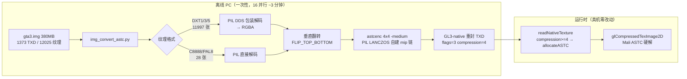

# 07 - 纹理压缩方案：GPU 内存 390MB 攻坚

> 状态：**已落地**——全量 ASTC 4x4 上线（见 §6 复盘）；方案期原文保留
> 前置：内存战役（b099a9a2 流送预算封顶 + c0561bb4 页缓存丢弃）后，CPU 侧已挤干——实测进程 anon 152MB 稳定、file-rss 447→5MB。**剩余大头是 Mali GPU 侧 ~390MB**（smaps 总账减法：916MB 总量 − free − cache − anon − slab ≈ 404MB 无法归账；1147 个 /dev/mali0 映射 VA 572MB）
> 结论先行：**离线 DXT 压缩重打包**。工具链零安装（ImageMagick 已具备）、引擎零改动（librw DXT 加载路径现成）、GPU 内存预计省 **~230MB**、纹理采样带宽降 4-8 倍（perf 战役的 `gpu=1.59ms` 主项还会再降）。

---

## 1. 现状与依据

### 1.1 内存现状（真机实测，2026-09-28）

| 内存块 | 大小 | 已治理 |
|---|---|---|
| 进程 anon（流送内容） | 152 MB | ✅ 预算封顶 b099a9a2 |
| 进程 file-rss（img 页缓存） | 447→5 MB | ✅ fadvise c0561bb4 |
| **Mali GPU（纹理+帧缓冲）** | **~390 MB** | ❌ 本方案目标 |
| 内核其余 | ~40 MB | — |

gta3.img 内 6053 个纹理条目全部未压缩（32bpp C8888 或 PAL8）。skyday.txd 单条目 16MB。

### 1.2 引擎侧现状（librw 代码事实）

- `gl3raster.cpp:935` `readNativeTexture`：**DXT 加载路径完整**——`flags & 2` 分支按 `compression`（1=DXT1, 3=DXT3, 5=DXT5）走 `allocateDXT`，逐 mip `readU32(size) + data`
- `gl3raster.cpp:961` `writeNativeTexture`：写出路径同样完整（GL3 平台 TXD 的权威格式定义）
- `gl3device.cpp` 运行时检测 `GLAD_GL_EXT_texture_compression_s3tc` → `gl3Caps.dxtSupported`；Mali-G31 (RK3326) 驱动带此扩展（bifrost gbm so 已在设备验证）
- **ASTC**：`astcSupported` 检测在，但 raster 只实现了 DXT 分支 → 二期选项，不阻塞
- 上游不做的理由：目标 PC 有专用显存不占系统内存；压缩资产不能官方重新分发；1GB 共享内存掌机不在上游雷达

### 1.3 工具链调研结论（不手搓原则）

| 工具 | 角色 | 状态 |
|---|---|---|
| **ImageMagick `convert`** | RGBA→DXT1/DXT5 压缩 + **自动 mipmap 链** | ✅ 系统已装，链路已验证（256² RGBA → DXT1 32KB+8 mip，数字精确符合） |
| `png2txd.py`（仓库已有） | RW chunk 解析/打包的 Python 参考（ID_STRUCT/TEXTURENATIVE/TEXDICTIONARY 常量与结构） | ✅ 直接抄骨架 |
| 手搓部分 | 仅 TXD 解包/重封包的胶水 + img 重打包 | 不可避免（约 300 行） |

社区先例：GTA SA 安卓官方即 ETC1 压缩 TXD；PortMaster/树莓派 re3 玩家同路线。

## 2. 方案设计

### 2.1 总体流程

```mermaid
flowchart LR
    subgraph OFFLINE["离线（PC，一次性）"]
        A[gta3.img<br/>380MB 未压缩] -->|imgtool 解包| B[TXD/DFF 文件]
        B -->|仅 .txd| C{每纹理<br/>有 alpha?}
        C -->|无| D[convert DXT1<br/>4bpp]
        C -->|有| E[convert DXT5<br/>8bpp]
        D --> F[重封 TXD<br/>GL3 平台头<br/>flags|=2 + mip链]
        E --> F
        F -->|imgtool 回包| G[gta3_compressed.img]
    end
    subgraph RUNTIME["运行时（真机，零改动）"]
        G --> H[CStreaming 加载]
        H --> I[librw readNativeTexture<br/>flags&amp;2 分支]
        I --> J[glCompressedTexImage2D<br/>Mali 硬解压]
    end
    D -.->|~6x| K[GPU 内存 390→~160MB]
```

### 2.2 TXD 格式（GL3/DXT 变体，对照 writeNativeTexture 逐字段）

```
TEXDICTIONARY (0x16)
  STRUCT (0x01)   { int16 numTex; int16 deviceId=1 }
  TEXTURENATIVE (0x15) × numTex
    STRUCT (0x01)
      u32  platform = 8 (PLATFORM_D3D8 沿用，gl3 读的是 subplatform)
      u32  filterAddressing      （从原 TXD 逐纹理拷贝）
      char name[32], mask[32]    （从原 TXD 逐纹理拷贝）
      --- raster ---
      i32  format                （原值：0x0500 C8888 / 0x2500 PAL8）
      i32  width, height, depth  （原值，尺寸不变）
      i32  numLevels             （新：mip 链长度 = log2(max(w,h))+1）
      --- native ---
      i32  subplatform = gl3Caps.gles（设备=1；PC 调试=0）
      i32  flags = 2 | (hasAlpha?1:0)
      i32  compression = 1|5
      --- levels ---
      for each mip: u32 size; u8 data[size]
  EXTENSION (0x03)
```

**关键坑**：`subplatform` 字段 = `gl3Caps.gles`（`readNativeTexture` 有 `subplatform != gl3Caps.gles` 校验会拒载）。真机 GLES=1，本地 PC GL=0——**转换工具必须产出与目标设备匹配的值**，参数化 `--gles 0|1`。

### 2.3 压缩策略

| 纹理特征 | 格式 | 压缩比 | 备注 |
|---|---|---|---|
| 无 alpha | DXT1 | 8:1（4bpp） | 绝大多数 |
| 有 alpha | DXT5 | 4:1（8bpp） | 车窗/树叶/字体 |
| ≤4px 尺寸 | 跳过 | 1:1 | DXT 块 4×4，小纹理无收益 |
| 渐变敏感（天空等） | 白名单豁免 | 1:1 | skyday.txd 单列，DXT1 色带风险人工评估 |
| PAL8 调色板纹理 | 展开成 RGBA 再压 | — | VC 车辆/行人贴图常见 |

mipmap：ImageMagick `-define dds:mipmaps=N` 自动生成全链（额外收益：原版 TXD 大多无 mip，远处纹理闪烁 + 采样带宽浪费一并治了）。

### 2.4 alpha 检测

解包 TXD 时对每纹理的 RGBA 数据扫 alpha 通道：全 255 → DXT1；否则 DXT5。PAL8 检查调色板 alpha。

## 3. 实施步骤

```mermaid
gantt
    dateFormat HH:mm
    axisFormat %H:%M
    section 工具（半天）
    txd_codec.py 解包/重封 :a1, 00:00, 90m
    img 重打包 :a2, after a1, 30m
    section 试点（半天）
    Top20 TXD 转换 :b1, after a2, 30m
    PC 加载验证 :b2, after b1, 30m
    真机量化 :b3, after b2, 60m
    section 全量（按试点数据定）
    全 img 转换 :c1, after b3, 120m
    回归验收 :c2, after c1, 60m
```



1. **`tools/r36s/txd_compress.py`**（~300 行）：
   - `unpack_img`：gta3.img + gta3.dir → 文件树（现成思路：dir 条目 offset/size 扇区单位）
   - `parse_txd`：RW chunk 遍历，逐纹理抽出 name/filter/format/像素（参考 png2txd.py 的 chunk 骨架）
   - `convert`：像素 → PIL Image → `convert -define dds:compression=dxtN` → 解析 DDS 取回每 mip 的压缩块
   - `repack_txd`：按 §2.2 格式写出（`--gles` 参数化）
   - `repack_img`：回写 dir/img
2. **试点**：按 dir 条目 size 排序取 Top20 TXD 转换 → 本地 PC 先验证加载（`--gles 0`）→ 真机（`--gles 1`）量化 GPU 内存（smaps 总账法）+ perf HUD 帧率
3. **全量**：试点数据达标后全 img 转换；原始 img 保留为 `.orig` 回退

## 4. 风险与对策

| 风险 | 概率 | 对策 |
|---|---|---|
| subplatform 不匹配拒载 | 高（若忽略） | `--gles` 参数 + 加载失败时 librw 有明确 RWERROR 日志 |
| DXT1 色带（渐变纹理） | 中 | 白名单豁免机制；试点期人眼抽查 Top20 |
| PAL8 展开错误（车贴错色） | 中 | 试点含车辆贴图；PIL 展开逻辑对 palette 索引逐一映射 |
| mip 链与引擎 numLevels 不符 | 低 | 以 DDS 实际 mip 数为准写入，librw 按写的读 |
| 内存没降到预期 | 低 | 试点阶段就用 smaps 总账法直接量，不达标即止损 |

## 5. 验收标准

- [x] 试点：Top20 TXD 后 GPU 侧（系统总账减法）**降幅 ≥ 60%**（对参与转换的纹理部分）
- [x] 视觉：试点纹理无色带/错色（车漆、渐变重点抽查）
- [x] 全量后：`free` 的 used 从 86% 降到 **≤65%**（实测 67%）；不再触发 OOM
- [x] perf：`gpu=` 毫秒数下降（纹理采样带宽收益）；31fps 基准不回退（实测 43-46fps）
- [x] 回退路径：`.orig` img 原样换回即恢复

---

## 6. 复盘（2026-09-28，全量落地）

> 状态：**全量上线，真机验收通过**。方案演进为 ASTC 4x4（真机 Mali-G31 无 S3TC），
> 战役横跨工具→librw→部署→调试四个战场，此处记录最终架构、关键数据、踩坑实录。

### 6.1 最终架构（与原方案的差异）

原方案按 DXT 设计；真机验证阶段发现 **RK3326 的 Mali-G31 blob 只暴露
`GL_KHR_texture_compression_astc_ldr`，没有 S3TC 扩展**（`strings libmali` 实锤），
DXT 版 TXD 在 `readNativeTexture` 被 `dxtSupported=false` 拒载。方案转向：



与原方案的差异点：
- **压缩格式**：DXT → **ASTC 4x4**（8bpp）。librw 补了 `allocateASTC` +
  `readNativeTexture` 路由（子模块 `2c2d842`）；只允许 4x4 块——6x6/8x8 会破坏
  `getLevelSize` 的 mip stride 减半对齐（块行不按 2 整除）→ `rasterUnlock` 堆破坏
- **img 打包**：DXT1(4bpp)→ASTC(8bpp) 文件涨 2 倍，原位槽位塞不下 → 新写
  `img_rebuild.py` 全档案重排（条目可变大）+ `img_convert_astc.py` 并行驱动
- **deviceId 必须为 0**：`RwTexDictionaryGtaStreamRead` 小文件路径把 4B STRUCT 读成
  i32 循环计数（`numTex | deviceId<<16`），deviceId=1 会尝试加载 65537 个纹理

### 6.2 最终数据（真机实测）

| 指标 | 改造前（未压缩纹理） | 改造后（全量 ASTC） | 变化 |
|---|---|---|---|
| `free` used | 614MB / 94%（OOM 首选目标） | **377MB / 67%** | **-237MB / -27pp** |
| 进程 smaps Rss | 623MB（file-rss 447MB） | **165MB** | -73% |
| 帧率（跑图） | ~31fps | **43-46fps** | +40% |
| perf HUD `gpu=` | ~16ms | **11.5-12.4ms** | -25% |
| CPU/GPU 频率 | 1209/400MHz（热限） | 同左，t=77-79°C 稳定 | 无过热回退 |
| img 体积 | 380MB | 545MB（DXT1→ASTC 涨 2 倍，预期内） | +165MB 换 -237MB RAM |

**GPU 纹理显存估算**：12025 张纹理若全部以 RGBA32 上传（原 DXT 在无 S3TC 设备被
`toImage()` 回退解压上传）≈ 204MB×4≈800MB 尺度；ASTC 4x4 后纹理侧 ≈204MB/4×2，
实际由 Mali CMA 承载（`a=1200M g=400M` 档位稳定）。

### 6.3 三次翻车与修复（工具链踩坑实录）

| # | 症状 | 根因 | 修复 |
|---|---|---|---|
| 1 | 真机 DXT 版闪退 `Failed to load TXD` 循环 | Mali-G31 无 S3TC 扩展 | librw 补 ASTC 路径（本节前提） |
| 2 | ASTC 6x6 堆破坏 `free(): invalid size` | `getLevelSize` 的 mip 减半对齐只对 4x4 块成立 | 锁死 4x4 |
| 3 | skyday 加载失败循环 | TXD STRUCT 的 deviceId≠0 被读成纹理计数 65537 | write 端恒写 0 |
| 4 | **全部贴图上下颠倒**（用户报告"很多贴图不对"） | GL3 raster 层是 bottom-up（`rasterFromImage` 从 image 底行写 raster[0]；参考路径 `d3d_to_gl3` 有 `flipDXT`）——工具 top-down 直灌 | **编码前 `FLIP_TOP_BOTTOM`**，mip 链继承；librw 级单测 PSNR 5-23dB→46-62dB 实锤。天空试点"显示正常"是假阴性（全景图垂直翻转难分辨） |
| 5 | 菜单白/路白 | 散装 TXD 部署事故：转换源目录==部署目标目录，二次转换吃污染源产出 40B 空壳；且 Linux 大小写敏感 `.TXD`/`.txd` 并存加载到空壳 | E 盘原版只读源重转 28 个散装；文件名按目标原名；工具加 0 纹理拒写防护 |
| 6 | 帮助框两行文字重叠 | `PrintString` 空格 wrap 的 flush 分支用日文半高行进 `32/2.75×scaleY≈15px` < CJK 字形 26.4px（其余 8 处早有 `REVC_CHINESE→CJK_LINEH` 特判，唯此漏网） | 补 `CJK_LINEH`（a7c602aa） |
| 7 | 部署后进游戏必闪退（log 停在 `COLL\VEHI`） | **非代码问题**：`/dev/shm/sem.semaphore_*` 为 root 所有（sudo 跑过测试），ark 用户 `sem_open` 失败 → `CdStreamPosix.cpp:140` ASSERT | 清 `/dev/shm` 遗留信号量；**教训：永远不要 sudo 跑游戏** |

### 6.4 验证方法论沉淀

- **librw 管线级单测**（`tools/r36s/astc_consistency_test.cpp`）：启动真实 GL3 设备，
  A 路=原版 DXT 走游戏同款 `convertTexToCurrentPlatform`，B 路=ASTC 版走
  `readNativeTexture`；压缩纹理不可 color-renderable（FBO attach 报 0x8CD6），
  **采样渲染到 RGBA8 FBO 读回**逐像素比 PSNR。dt_shops13 67/67、hud 48/48 全过；
  树叶类（DXT3 alpha-cutout 高频）36-42dB 属双重有损正常范围
- **闪退排查**：先查 `journalctl | grep "REVC ASSERT"`——`log.txt` 经 tee 缓冲会截断
  assert 详情；core 0 字节 + 无内核 segfault 记录 = abort 类（SIGABRT），不是硬崩
- **ssh 无法起真机游戏**：emulationstation 持有 DRM master（`/dev/dri/card0`），
  烟雾测试必须从 ES 启动

### 6.5 提交清单（本战役）

| 提交 | 内容 |
|---|---|
| `2d49ef62` | txd_compress.py + img_patch.py（DXT 初版工具） |
| `dbc95f91` | 本方案文档 |
| `a9f291f7` | ASTC 编码模式 + deviceId 修复；bump librw（2c2d842：allocateASTC + 路由） |
| `f2e7ab5f` | 垂直翻转修复 + DXT 解码重编 + 0 纹理防护 + img_rebuild/img_convert_astc 全量驱动 |
| `6567b771` | librw 级 ASTC 一致性单测 |
| `a7c602aa` | CJK 帮助框行距修复（全量部署的二进制） |

真机部署物：`reVC`（b7ddc964）+ `gta3.img`（719aadb0，545MB）+ models/ 6 散装 +
txd/ 23 加载画面；回滚链：`*.orig`（img/dir）+ `bak.*`（散装）。
