# 09 - R36S 三缓冲呈现方案设计（解开 swap 的 fence 串行）

> 目标平台：R36S（RK3566 / Mali-G51 blob / Linux 4.4 KMSDRM）
> 前置：docs/08 性能深挖。结论：fps 28-33 的天花板是双缓冲 fence 串行——
> `eglSwapBuffers` 内 `poll(/dev/mali0)` 等 GPU 释放 buffer ~10ms，
> CPU 提交（~20ms）与 GPU 排空（~10ms）被迫串行。
> 参考实现：re3 主仓 `src/skel/gbm/` + `docs/16-异步呈现流水线设计.md`
> （Pi Zero 2 W 双 FBO 乒乓，gpu 等待 3.46→0.02ms，+10fps）。

---

## 1. 现状时序（问题的本质）

```
当前（SDL KMSDRM + Mali blob 双缓冲）:

帧N:   [CPU 提交 20ms]──[swap: poll(mali0) 等 GPU 释放 buffer ~10ms]
                          └── GPU 在渲染帧N-1，没渲完就不能复用 buffer
帧时 = CPU + GPU串行等待 ≈ 30-35ms（fps 28-33）
```

关键事实链（全部实测，见 docs/08 §2/§7）：

1. `VSync=0` 生效（`[swapinterval] want=0`，仅 4 次菜单切换）——但没用
2. swap 的等待 = `poll(/dev/mali0, POLLIN, -1)` ≈10ms（LD_PRELOAD 钩 `poll()` 实测，fd 已确认是 kbase 设备）
3. 这是**双缓冲的 buffer 复用 fence 语义**：blob EGL 在 `eglCreateWindowSurface` 内部分配 buffer，无任何配置入口（环境变量/SDL 选项/gbm 接口都翻过）
4. GPU 真实整帧执行 ≈10ms（timer query 只测到提交段 0.3ms，fence 等待才是整帧栅格化）
5. CPU 提交 20ms 里一半是 blob CMAR 队列固定成本（perf：libmali self 48.6%）

**本质**：CPU 和 GPU 都只半满，被双缓冲 fence 强制串行。三缓冲让
"渲染中的 buffer / 待扫描的 buffer / CPU 正在写的 buffer"三个角色分开，
CPU 永远有 buffer 可写 → CPU‖GPU 真并行。

## 2. 为什么不能"直接开三缓冲"

| 尝试路径 | 结论 |
|---|---|
| SDL triple buffer 选项 | ❌ 不存在（SDL 2.0.32 strings 全翻） |
| Mali blob 环境变量 | ❌ 无 buffer count 配置项 |
| gbm_surface 参数 | ❌ buffer 数由 blob EGL 内部分配，不暴露 |
| LD_PRELOAD 钩 eglSwapBuffers | ❌ SDL KMSDRM 硬编码 `dlopen("libmali-bifrost-g31-rxp0-gbm.so")` + dlsym 直取指针，绕过拦截 |

**唯一出路**：不再让 blob EGL 拥有窗口 surface——改为**离屏渲染 + 自管呈现链**
（re3 GBM 方案同款思路，但呈现端不同：Pi 是 SPI 小屏，我们是 KMS 大屏）。

## 3. 方案设计

### 3.1 总体架构

```mermaid
flowchart LR
    subgraph CPU主线程
        A[游戏逻辑+渲染提交<br/>~20ms] --> B[glFlush 提交到 GPU<br/>不等待]
        A2[帧N+1 渲染提交...] 
    end
    subgraph GPU
        C[渲染到 FBO_B<br/>帧N 命令]
        C2[渲染到 FBO_A<br/>帧N+1 命令]
    end
    subgraph 呈现线程（新增）
        D[blit FBO_上一帧<br/>到 gbm BO] --> E[drmModePageFlip<br/>非阻塞排队]
        F[poll(drmfd)<br/>等 flip 事件<br/>归还 BO]
    end
    A -->|命令流| C
    A2 -->|命令流| C2
    C -.完成事件.-> D
```

**三个解耦点**（对应三个"缓冲"角色）：

1. **渲染目标**：主相机挂双 FBO 乒乓（`fbo_A/fbo_B`），CPU 帧间交替提交，
   永不等 GPU（去掉 swap 内的 fence 等待）
2. **呈现缓冲**：gbm bo × 2-3，呈现线程 blit 已完成帧 → `drmModePageFlip`
   排队 → 等 flip 事件归还 bo（这一步在**独立线程**，不卡主线程）
3. **扫描输出**：KMS 扫描正在显示的 bo，与上两者无竞争

### 3.2 帧时序目标

```mermaid
gantt
    dateFormat X
    axisFormat %s
    title 三缓冲并行流水（目标帧时 ~20ms → 50fps 上限）
    section CPU
    提交帧N    :0, 20
    提交帧N+1  :20, 40
    section GPU
    渲染帧N    :2, 12
    渲染帧N+1  :22, 32
    section 呈现线程
    blit+flip帧N-1 :0, 6
    blit+flip帧N   :12, 18
    section 屏幕
    显示帧N-2  :0, 16
    显示帧N-1  :16, 33
```



帧时从 `CPU 20 + GPU 等待 10 = 30ms`（串行）变为 `max(CPU 20, GPU 12) = 20ms`
（并行），fps 28 → **理论上限 50**（CPU 提交成为唯一瓶颈，与 docs/08 结论一致：
blob 每调用固定成本是下一个战场）。

### 3.3 实现改动点

**A. librw gl3（GBM 化改造，参考 re3 已有实现）**

| 文件 | 改动 | 参考 |
|---|---|---|
| `gl3raster.cpp` `rasterCreateCamera` | 主相机 raster 建双份 (RGBA8888 tex + FBO)，共享一个 depth RBO 每帧重挂 | re3 `Gl3Raster.fbo2/texid2` |
| `gl3device.cpp` `showRaster` | GBM 分支：无 `glFinish`；flip `fbo↔fbo2`；导出 `gl3_get_present_fbo()` | re3 已实现（可直接搬） |
| 新增 `gl3device.cpp` KMSDRM 呈现 | 自建 gbm device/surface 替代 SDL 的：`gbm_create_device(drmfd)` + 自管 bo 池 | 本方案新增 |

**B. 骨架层（新 skel 或改造 sdl2.cpp）**

1. **DRM 主设备**：`open("/dev/dri/card0")` + `drmModeGetResources` 找
   connector/crtc/encoder（ArkOS 单屏，固定 card0+HDMI 或 MIPI）
2. **gbm bo 池 ×3**：`gbm_bo_create(gbm, w, h, XRGB8888, GBM_BO_USE_SCANOUT | GBM_BO_USE_RENDERING)`，
   blob EGL 的 `eglCreateImageKHR` + `glEGLImageTargetTexture2DOES` 把 bo 导入为
   GL 纹理（**blob 支持 EXT_image_dma_buf_import**，需启动时探测）
3. **呈现线程**（新增，或复用现有工作线程）：
   - 从"完成队列"取上一帧的 present fbo
   - `glBlitFramebuffer`（或全屏 quad）到下一个空闲 bo 的 fbo
   - `drmModePageFlip(crtc, fb[bo], DRM_MODE_PAGE_FLIP_EVENT)` 非阻塞
   - `poll(drmfd)` 收 flip 事件 → bo 归还池子
4. **主循环**：`psCameraShowRaster` 只做 `glFlush`（不 swap！），把
   `gl3_get_present_fbo()` 推入完成队列后立即返回

**C. 上下文问题（关键风险点）**

- 主线程与呈现线程**共享一个 EGL context 还是各持一个**？
  共享：简单但 blit 需要主线程让出（makeCurrent 切换有开销）
  各持 share context：`eglCreateContext(dpy, cfg, share, ...)` 共享纹理命名空间，
  呈现线程独立 makeCurrent——**推荐**，blob 需验证 share 语义
- FBO 纹理跨线程传递必须配 **fence**（`eglCreateSyncKHR` + `glWaitSync`），
  保证 blit 前渲染确实完成——这是三缓冲正确性的基石

**D. 输入/窗口**

- SDL 仍可用于输入（`SDL_Init(SDL_INIT_JOYSTICK|...)` 不初始化 video），
  或直接走 evdev（re3 gbm skel 有现成 `input_evdev.cpp`）
- 分辨率/旋转：RK3566 屏幕参数从 `reVC.ini` 或 drm mode 读取

### 3.4 回退开关

编译宏 `REVC_KMS_TRIPLE`，运行时 ini `[Video] TripleBuffer=0/1`。
失败路径：宏关闭即回 SDL KMSDRM 现状（零改动风险）。

## 4. 风险与对策

| 风险 | 等级 | 对策 |
|---|---|---|
| blob `EXT_image_dma_buf_import` 缺失（bo 无法导入 GL） | **高** | 方案启动前先写 20 行探测程序验证；失败则 bo 只能 CPU 拷贝（`gbm_bo_map` + `glReadPixels`，多 1-2ms 但仍解 fence 串行） |
| blob share context 语义坑（纹理跨 context 不可见） | 高 | 探测程序一并验证；失败则单 context + 主线程 blit（收益减半但仍有） |
| fence 使用不当 → 撕裂/错帧 | 中 | re3 双 FBO 乒乓已验证同款逻辑（模拟器+Pi 实测无撕裂），沿用其"读上一帧"策略天然安全 |
| 深度共享冲突 | 低 | re3 实测共享 depth RBO + 每帧重挂可行（docs/16 §10） |
| 延迟 +1 帧（~30ms） | 低 | 手柄游戏可接受（re3 实测手感无感） |
| ArkOS 前端切换冲突（DRM master 抢占） | 中 | 启动时 `drmSetMaster` 失败即回退 SDL；退出时 `drmDropMaster` |
| 温度：GPU 并行满载 74°C → 更热 | 中 | 实测后决定是否回调 GPU 400MHz 或开 fps 上限 45 |

## 5. 工作量与验证计划

**工作量**：探测程序（半天）→ librw GBM 分支搬运（re3 现成代码，1 天）→
KMSDRM 呈现链（2-3 天）→ 联调修复（1-2 天）≈ **一周**

**验证**（沿用 docs/08 工具链）：

1. PC 模拟（SDL 窗口 + 双 FBO 乒乓先行验证画面正确性）
2. 真机 A/B：PerfHud 对比 `gpu(swap)` 10ms → 目标 <1ms；fps 28 → 目标 40+
3. LD_PRELOAD poll 钩子复测：`/dev/mali0` 长等待应消失
4. 画质/撕裂/延迟手感三连过

## 6. 预期收益（基于实测数据推演）

| 指标 | 现状 | 预期 |
|---|---|---|
| swap 等待 | ~10ms（fence） | <1ms（glFlush 即返） |
| 帧时构成 | CPU 20 + GPU 等待 10 串行 | max(CPU 20, GPU 12) 并行 |
| fps（闹市区） | 28-33 | **40-48**（CPU 成为唯一瓶颈） |
| 输入延迟 | +0 | +1 帧 (~30ms) |

下一个瓶颈将是 CPU 提交（blob 每调用固定成本 × 440 draws），那是
docs/08 §4 纹理图集的战场，与本方案正交可叠加。
