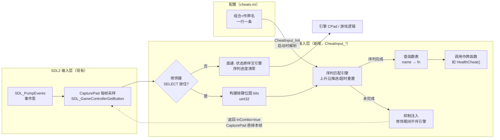
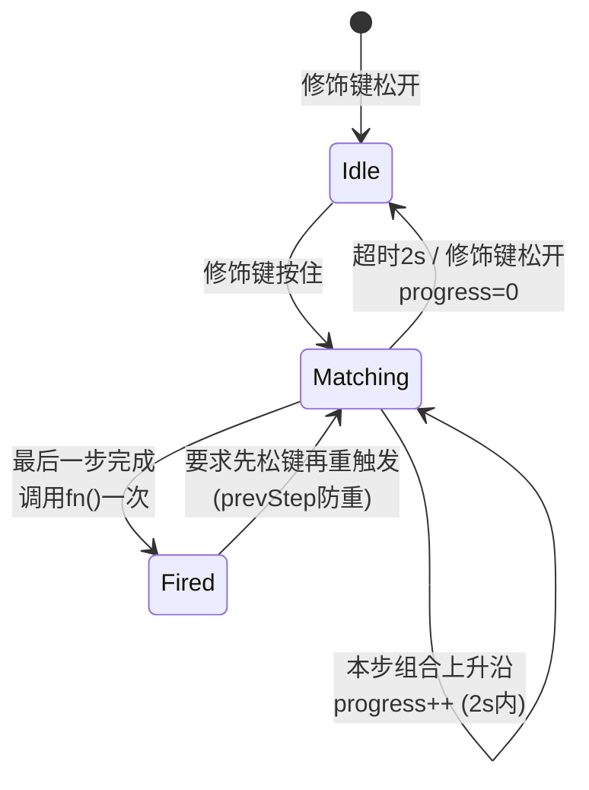

# 10 - R36S 手柄作弊码快捷输入设计（组合键 → 作弊码，配置文件驱动）

> 目标：在 R36S 掌机上用**手柄组合键**快速触发罪恶都市的作弊码（满血、武器、
> 刷车、天气……），不用打键盘序列。映射放在 `cheats.ini`，改配置即可增删重绑，
> 不用重编译。
>
> 参考实现：re3 主仓 `src/skel/gbm/cheat_input.cpp` + `docs/18-手柄作弊码快捷输入设计.md`
> （已在其 Pi Zero 移植上落地验证）。本文按 reVC/R36S 的实际差异重新设计，
> 只做设计不含实现代码，施工按 §7 走。

---

## 1. 现状调研（两边已有什么）

### 1.1 reVC 的作弊码本体（比 re3 丰富得多）

`src/core/Pad.cpp` 里每个作弊码就是一个无参全局函数，签名统一 `void f(void)`，
天然适合做「名字 → 函数指针」表。reVC 全集（按 Pad.cpp 行序）：

| 类别 | 函数 | 效果 |
|---|---|---|
| 武器 | `WeaponCheat1/2/3()` | 三档武器包 |
| 生存 | `HealthCheat()` `ArmourCheat()` `SuicideCheat()` | 血/甲/自杀 |
| 财物 | `MoneyCheat()` | +$250k |
| 载具 | `VehicleCheat(model)` 系（见 §4.3 特殊处理）| 刷指定车 |
| 混乱 | `BlowUpCarsCheat()` `MayhemCheat()` `EverybodyAttacksPlayerCheat()` `MadCarsCheat()` | 爆车/暴乱/围攻/疯狂车流 |
| 通缉 | `WantedLevelUpCheat()` `WantedLevelDownCheat()` | ±通缉 |
| 时间 | `FastTimeCheat()` `SlowTimeCheat()` | 时间流速 |
| 天气 | `SunnyWeatherCheat()` `ExtraSunnyWeatherCheat()` `CloudyWeatherCheat()` `RainyWeatherCheat()` `FoggyWeatherCheat()` `FastWeatherCheat()` | 六种天气 |
| 外观 | `BlackCarsCheat()` `PinkCarsCheat()` `TrafficLightsCheat()` | 车色/红绿灯 |
| 玩法 | `ChangePlayerCheat()` `WeaponsForAllCheat()` `ChittyChittyBangBangCheat()` `StrongGripCheat()` `FannyMagnetCheat()` `KangarooCheat()` `AllCarsHeliCheat()` `WallClimbingCheat()` `FlyingFishCheat()` | 变身/飞行/爬墙等 VC 特色 |
| 其他 | `OnlyRenderWheelsCheat()` `NoSeaBedCheat()` `RenderWaterLayersCheat()` | 渲染彩蛋 |

与 re3 的差异：**没有 re3 的 `tank/blowupcars` 直呼**——VC 的坦克是
`VehicleCheat(MODEL_RHINO)`（带参），需要在函数表外做一层包装（§4.3）。

### 1.2 已有的 PS2 按键序列（默认关闭，可借鉴思路）

`CPad::AddToCheatString()`（`GTA_PS2_STUFF`，默认不编译）把按键转字符压环形缓冲，
与写死序列比较，如 `"URDLURDL4144"` → `WeaponCheat1`（URDL=十字键，数字=面键）。
思路可借鉴（按键→标记、序列匹配），但序列写死、逐键长序列易误触，不满足需求。

### 1.3 R36S 输入链路（与 re3 的 evdev 不同！）

re3 的 Pi 移植走 **evdev 直采**（`input_evdev.cpp` 的 `gamepad_read_state`）；
reVC/R36S 走 **SDL2 GameController**（`src/skel/sdl2/sdl2.cpp` 的 `CapturePad`）：

```
SDL 事件泵 → CapturePad(padID) 每帧全量采样:
  SDL_GameControllerGetButton × SDL_CONTROLLER_BUTTON_MAX
  → ControlsManager.m_NewState.buttons[] / mappedButtons[]
  → RsPadButtonStatus → 引擎 Pad
```

**钩子点选择**：在 `CapturePad` 采样完成后、状态交给引擎前插一层
`CheatInput_Process(state)`——与 re3 在 evdev 采样点挂钩完全同构，
拿到的都是「每帧全量按键位图」，序列引擎逻辑可以原样搬。

### 1.4 R36S 手柄布局（SDL 标准映射）

R36S 内置手柄在 SDL 里是标准 gamecontroller（启动脚本还注入
`SDL_GAMECONTROLLERCONFIG`），按键名与 re3 的 DualSense 表一致：

| SDL 按钮 | 键名（ini 用） | 用途冲突 |
|---|---|---|
| A/B/X/Y | CROSS / CIRCLE / SQUARE / TRIANGLE | 游戏主操作 |
| L1/R1 | L1 / R1 | 武器切换 |
| L2/R2 | L2 / R2（模拟） | 瞄准/射击 |
| L3/R3 | L3 / R3 | 视角 |
| Select/Start | SELECT / START | 菜单/暂停 |
| 十字键 | UP/DOWN/LEFT/RIGHT | 换武器（可作修饰键伴键） |

R36S **没有** DualSense 的 Create 键——re3 默认修饰键 `CK_CREATE` 在这里
要映射到 `SELECT`（R36S 的 Select 平时只做菜单呼出，游戏内基本闲置，是
最安全的修饰键候选，见 §3 风险）。

---

## 2. 方案设计

### 2.1 总体架构



### 2.2 配置文件格式（与 re3 cheats.ini 兼容）

```ini
; cheats.ini - 组合键 = 作弊码（放游戏目录，与 reVC.ini 同级）
; 语法: <按键组合序列> = <作弊名>
;   组合:  +号连接同按键，逗号分隔多步序列（可单步）
;   修饰:  SELECT 必须全程按住（代码自动折入，不用写）
; 示例:

; —— 单步组合（最常用）——
UP+UP = health
DOWN+DOWN = armour
TRIANGLE+TRIANGLE = money
CROSS+CROSS = weapon1
CIRCLE+CIRCLE = weapon2
SQUARE+SQUARE = weapon3

; —— 载具（VC 特色，见 §4.3 包装）——
UP+TRIANGLE = vehicle_rhino        ; 坦克
UP+CIRCLE = vehicle_banshee        ;跑车

; —— 多步序列（GTA 风味，防误触的少见作弊）——
UP,UP,DOWN,DOWN,LEFT,RIGHT,LEFT,RIGHT = mayhem
CROSS,CROSS,UP = wanted_up
CIRCLE,CIRCLE,DOWN = wanted_down
L1,R1,L1,R1 = sunny
```

规则（沿用 re3 实测过的语义）：
- **修饰键**（默认 SELECT）自动折入每一步，序列只在修饰键按住期间被识别
- **上升沿触发**：按住不重复；同一步内键序无关（位图匹配）
- **序列超时** 2s：中途停顿太久自动从头
- **修饰键一松**：所有序列进度清零
- 修饰期间 `CheatInput_Process` 返回 `true`，`CapturePad` **吞掉本帧状态**
  （清零交给引擎），避免「输作弊码时游戏里同时开枪/换武器」

### 2.3 键表（X-macro 单一事实源）

新建 `src/skel/sdl2/cheat_keys.def`（从 re3 原样搬，改名 CREATE→SELECT）：

```c
/* face buttons */
CHEAT_KEY(CROSS,     0)
CHEAT_KEY(CIRCLE,    1)
CHEAT_KEY(TRIANGLE,  2)
CHEAT_KEY(SQUARE,    3)
/* shoulders / triggers */
CHEAT_KEY(L1,        4)
CHEAT_KEY(R1,        5)
CHEAT_KEY(L2,        6)     /* 模拟，阈值 200/255 */
CHEAT_KEY(R2,        7)     /* 模拟，阈值 200/255 */
/* stick clicks */
CHEAT_KEY(L3,        8)
CHEAT_KEY(R3,        9)
/* menu buttons */
CHEAT_KEY(SELECT,   10)
CHEAT_KEY(START,    11)
/* dpad */
CHEAT_KEY(UP,       12)
CHEAT_KEY(DOWN,     13)
CHEAT_KEY(LEFT,     14)
CHEAT_KEY(RIGHT,    15)
```

位图 16 位放进 `uint32`，与 re3 完全同构——**序列引擎代码可原样移植**。

---

## 3. R36S 特有的风险与对策

| 风险 | 分析 | 对策 |
|---|---|---|
| SELECT 做修饰键与系统热键冲突 | R36S 的 Select+Start 等组合被 **gptokeyb/oga_events** 拿走做音量/亮度等系统功能 | 序列引擎天然只在「游戏内」识别（`m_bMenuActive` 时直通）；若实测冲突，修饰键改 `L3+R3` 同按（ini 可配 `modifier = ...`） |
| 十字键是游戏内换武器 | `UP+UP` 这类序列第一步会先触发换武器 | 修饰键期间**整帧吞掉**（§2.2），引擎根本收不到那次换武器——修饰键本身比序列更早保护 |
| 误触 | 掌机口袋里按到 | 双层防护：修饰键 + 多步序列默认用于高危作弊（自杀/暴乱）；ini 删掉不想要的即物理移除 |
| 触发无反馈 | 作弊函数自带 CHelpMessage 提示（"_cheat" 文案） | 无需额外 UI；VC 的帮助消息在屏幕左下自然弹出 |
| 与帧率选择器共存 | 无耦合（不同子系统） | 无 |

---

## 4. 实现改动点

### 4.1 新文件：`src/skel/sdl2/cheat_input.{h,cpp}` + `cheat_keys.def`

从 re3 `src/skel/gbm/cheat_input.cpp` 移植，改动清单：

| re3 原文 | reVC 适配 |
|---|---|
| `#if defined LIBRW_GBM && RE3_CHEATS` | `#if defined REVC_CHEATS`（新 CMake 选项，默认 OFF） |
| 挂钩 `evdev_capturePad` | 挂钩 `CapturePad`（sdl2.cpp）采样后 |
| `CControllerState` 字段 | 用 reVC 的 `CControllerState`（字段名一致：Cross/Circle/…/DPadUp） |
| 修饰键 `CK_CREATE` | `CK_SELECT` |
| cheat 表 23 项 | 换 §4.2 的 VC 全表 |

### 4.2 函数表（VC 全集，含包装）

```cpp
// 直呼的（与 re3 同构）
{"health", HealthCheat}, {"armour", ArmourCheat}, ...
// 带参/特殊需要薄包装（static 函数）
static void RhinoCheat(void)   { VehicleCheat(MI_RHINO); }
static void BansheeCheat(void) { VehicleCheat(MI_BANSHEE); }
// ... 按需收录, 名单即文档
{"vehicle_rhino", RhinoCheat}, {"vehicle_banshee", BansheeCheat}, ...
```

车辆名单建议只收录 6~8 台标志性车（坦克/跑车/摩托/直升机），其余用户想加自己
写包装或我们后续补 `vehicle_<modelname>` 泛型解析（读 `default.ide` 名字太重，
不做）。**带参包装必须列白名单**——不能让 ini 传任意 model id（防呆）。

### 4.3 钩子：`CapturePad` 尾部插入

```cpp
// sdl2.cpp CapturePad() 采样完成后:
#ifdef REVC_CHEATS
    if (CheatInput_Process(ControlsManager.m_NewState,
                           FrontEndMenuManager.m_bMenuActive)) {
        // 修饰键按住: 吞掉本帧, 不让引擎看到(防序列内误操作)
        memset(&ControlsManager.m_NewState, 0, sizeof(...));
    }
#endif
```

注意：re3 是在**事件源**层吞，reVC 在 **CapturePad 出口**吞——语义等价
（引擎看到的就是零状态）。

### 4.4 配置加载与 CMake

- `CheatInput_Init()` 在 `psInitialize` 尾部调（`REVC_CHEATS_FILE` 环境变量
  可覆盖路径，默认游戏目录 `cheats.ini`）
- CMake：`option(REVC_CHEATS ...)` 默认 OFF；真机构建链 build.sh 加 `--cheats`
  开关（与 `--triplebuf` 同款参数模式）
- 无 cheats.ini 时**静默禁用**（re3 同款行为），零开销

---

## 5. 序列匹配引擎（从 re3 原样移植的核心状态机）



要点（re3 实测过的坑，全部保留）：
1. **上升沿**：`stepNow && !prevStep`——长按只算一次，不自动连发
2. **Fired 后防重**：`prevStep=1` 置位，要求释放当前组合才能开新一轮
3. **超时**：`mono_ms()` 差值 >2000ms 重置该序列（不同序列独立计时）
4. **修饰键释放**：全部序列立刻归零（退出作弊模式的语义）
5. 菜单激活时直通+归零（避免在设置界面里输序列）

---

## 6. 工作量与验证计划

**工作量**：1 天（引擎移植 2h + VC 函数表与包装 2h + 钩子与 CMake 1h +
真机联调 2h + 文档收尾 1h）。

| 步骤 | 验证点 |
|---|---|
| 1. PC 先行（`build-tb` 同款流程） | 键盘模拟手柄？不必——PC 用真手柄/`sdl2-jtest` 验证序列引擎；无手柄则直接真机调 |
| 2. 真机部署（`build.sh Release --cheats --triplebuf`） | log 出现 `cheats: N mapping(s) loaded` |
| 3. 单步组合 | SELECT+UP+UP → 满血，左下角弹提示 |
| 4. 多步序列 | SELECT+上上下下左右左右 → 暴乱 |
| 5. 吞帧验证 | 输序列期间游戏不换武器/不开枪 |
| 6. 防重触发 | 长按不连发；松修饰键立刻归零 |
| 7. ini 增删 | 删一行重启即消失，不重编 |

**发布形态**：`--cheats` 构建默认带一份 `cheats.ini.example`（即 §2.2 示例），
用户拷成 `cheats.ini` 即启用；不拷 = 功能不存在。

---

## 7. 与既有成果的关系

- 与三缓冲呈现链（docs/09）**零耦合**：不同子系统，可任意组合构建
- 与帧率选择器（docs/09 §7 后续）**零耦合**：菜单设置 vs 输入钩子
- 序列引擎来自 re3 已落地代码——**移植而非重写**，风险低
- 唯一真机待验证项：SELECT 修饰键与 gptokeyb 系统热键的共存性（§3 第 1 行），
  若冲突换 `L3+R3`（ini `modifier` 配置已预留设计位）
