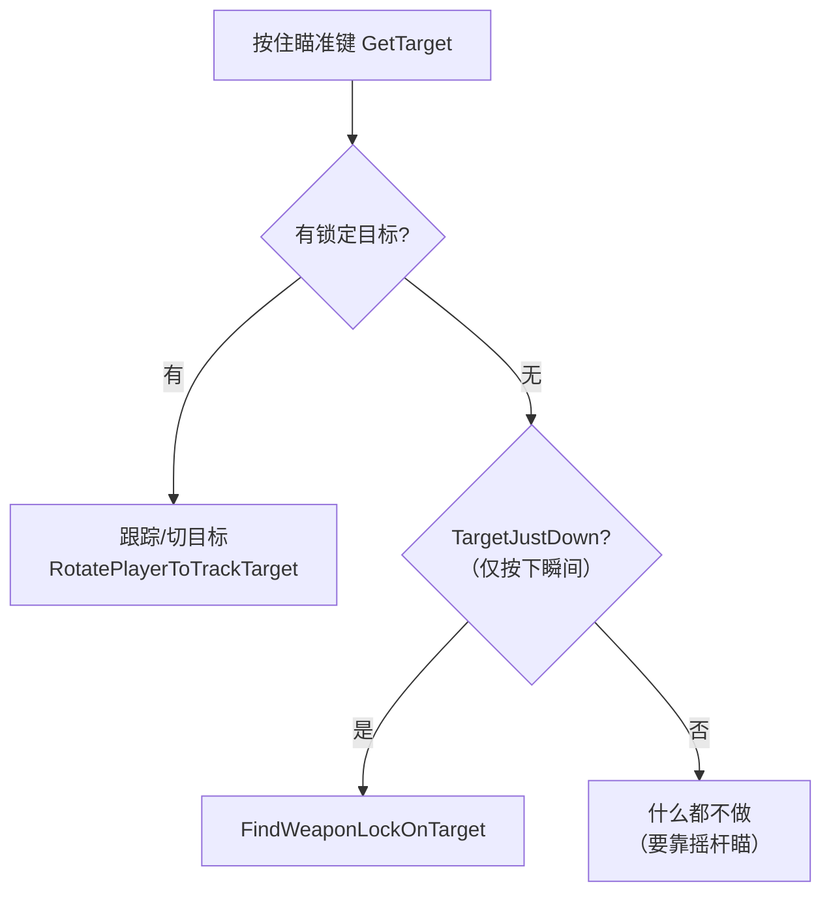
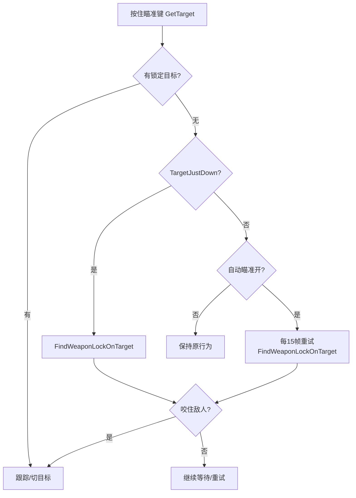

# R36S 自动瞄准辅助（Aim Assist）设计

> 状态：已实现并部署（2026-10-01）
> 关联：docs/09 三缓冲呈现、docs/10 手柄作弊码输入（同为 R36S 手柄体验优化系列）

## 1. 背景

R36S 摇杆精度有限，原版 VC 的自由瞄准（右摇杆微调准星）在掌机上非常难用。
本方案采用 **A 方案（自动锁定）**：按住瞄准键时自动把准星"咬"住最近的敌人，
不需要摇杆精确指向；松开瞄准键自动脱锁。菜单提供开关（默认开启），带中文翻译。

## 2. 游戏内现有机制（复用，不重造）

VC 本身有一套完整的锁定体系，本方案只是把它的触发条件放开：

| 函数 | 位置 | 作用 |
|---|---|---|
| `CPlayerPed::FindWeaponLockOnTarget()` | PlayerPed.cpp:1107 | 在扇形/可见性/射程约束下挑最优目标并 `SetWeaponLockOnTarget` + `SetPointGunAt` |
| `CPlayerPed::FindNextWeaponLockOnTarget()` | PlayerPed.cpp:1065 | 左右切换目标（EvaluateNeighbouringTarget） |
| `CPlayerPed::RotatePlayerToTrackTarget()` | PlayerPed.cpp:1057 | 锁定后身体持续朝向目标 |
| `CWeaponEffects::MarkTarget()` | PlayerPed.cpp 末尾 | 目标身上画红/橙标记 |

原版触发路径（`ProcessPlayerWeapon`）：

问题出在两条竖向闸门：

1. **触发时机**：无目标分支只在 `TargetJustDown()`（按下瞬间）尝试锁定一次；
   没咬住就只能靠摇杆。且 `Method=0`（标准手柄）时分支条件
   `!CCamera::m_bUseMouse3rdPerson` 为 false，**整条锁定路径直接被跳过**。
2. **保留条件**：已有目标时，`(!bFreeCam && m_bUseMouse3rdPerson)` 会立刻
   `ClearWeaponTarget()`，手柄模式下锁上也留不住。

## 3. 方案（Option A）

三处改动（全部带 `m_PrefsAutoAim` 开关，关闭后行为与原版一致）：

1. **自动获取**（PlayerPed.cpp `ProcessPlayerWeapon`）：
   无目标分支的条件从 `!m_bUseMouse3rdPerson` 放宽为
   `!m_bUseMouse3rdPerson || m_PrefsAutoAim`；按住瞄准且未锁定时，
   除按下瞬间外每 15 帧（50fps 下约 0.3s）重试一次 `FindWeaponLockOnTarget()`，
   既覆盖"第一口没咬住"也覆盖"目标死亡后自动换咬"。
2. **锁定保留**（同函数）：`m_pPointGunAt` 存在时的清除条件加上
   `&& !m_PrefsAutoAim`，手柄模式下锁住不再被秒清。
3. **长枪跳过第一人称**：M4/Ruger/M60 原本按瞄准键进入 1st-person 精确瞄准
   （掌机上同样难用）；自动瞄准开启时跳过，直接走第三人称锁定路径。
   狙击枪/火箭筒/相机不动（它们的第一人称是核心玩法）。

目标评估沿用原版 `EvaluateTarget`：`-dist - 5*|angle|`，含优先级加成
（警察/攻击者 +30），并要求 `OurPedCanSeeThisOne`（可见）与
`CanIKReachThisTarget`（可达），射程为武器射程。M4 之类 CANAIM 武器
（weapon.dat flags 0x28840 等含 CANAIM 位）全部覆盖；手枪等
CANAIM_WITHARM 武器原本就走锁定路径，同样受益。

## 4. 菜单与翻译

- 位置：**设置 → 控制器（FET_CTL）**，"自动瞄准"（`FEM_AIM`），右值 FEM_ON/FEM_OFF。
- 开关动作 `MENUACTION_AUTOAIM`：单击/左右键循环切换，切换即 `SaveSettings()`。
- 持久化：`reVC.ini` `[Controller] AutoAim=0/1`（`ReadIniIfExists`/`StoreIni`，
  与 FrameLimiter 同模式）；`恢复默认` 后为开。
- 翻译：`translation.txt` 新增 `[FEM_AIM] 自动瞄准`，经
  `tools/l10n/gen_cn_font.py` + `tools/l10n/png2txd.py` 再生成
  `JAPANESE.GXT` + `MODELS/FONTS_J.TXD`（本次再生成同时补上了此前
  缺失的 `FEM_UNL`（无限）条目）。

## 5. 实现记录

| 项 | 内容 |
|---|---|
| 枚举/成员 | Frontend.h：`MENUACTION_AUTOAIM`；`int8 m_PrefsAutoAim` |
| 默认值 | Frontend.cpp 构造函数 `m_PrefsAutoAim = 1`（默认开）；RestoreDef 显示/控制两分支均恢复为 1 |
| 右值显示 | Frontend.cpp `DrawStandardMenus`：`case MENUACTION_AUTOAIM` → `FEM_ON`/`FEM_OFF` |
| 切换 | Frontend.cpp `ProcessOnOffMenuOptions`：取反 + `SaveSettings()` |
| INI | re3.cpp `LoadINISettings`/`SaveINISettings`：`[Controller] AutoAim` |
| 菜单项 | MenuScreensCustom.cpp `MENUPAGE_CONTROLLER_PC`：`MENUACTION_AUTOAIM "FEM_AIM"` |
| 钩子 | PlayerPed.cpp `ProcessPlayerWeapon` 三处（获取/保留/跳过1st-person） |
| 生成物 | l10n-out/JAPANESE.GXT（200164B）+ l10n-out/FONTJAP.txd（656552B，1 纹理 FONTJAP/FONTJAP_mask） |
| 部署 | reVC（md5 1bb55285…）+ text/JAPANESE.GXT + MODELS/FONTS_J.TXD，三文件 md5 双侧一致 |

### 排查记录

- **librw 纹理掩码**：`Texture::read` 对 mask 参数 `(void)mask`，仅按名字查找，
  故 TXD 中 mask 字段为纯元数据，再生成安全（历史产物 mask 名为
  `FONTJAP_mask=l10n-out/FONTJAP.p…`，是当年把 spec 串误传给 `--mask` 的残留，
  本次已规范为 `FONTJAP_mask`）。
- **标准手柄模式陷阱**：`Method=0` ⇒ `m_bUseMouse3rdPerson=true`，原锁定分支
  条件使其整体失效；只加"重试"不放宽条件等于没加。这是本方案最容易踩的坑。

## 6. 验证清单

- [ ] 菜单：设置→控制器 出现"自动瞄准：开/关"，切换后退出重进保持
- [ ] 默认开启（删除 `[Controller] AutoAim` 后启动即为开）
- [ ] 手枪/步枪：按住瞄准（不碰右摇杆）自动咬住视野内最近敌人，红标出现
- [ ] 目标死亡后 0.3s 内自动换咬下一个
- [ ] 左右键（ShiftTarget）可手动换目标
- [ ] 松开瞄准键立即脱锁
- [ ] M4/Ruger/M60 不再进第一人称，直接锁定；狙击枪仍进第一人称
- [ ] 关闭开关后行为与原版完全一致
- [ ] 恢复默认后自动瞄准回到开
- [ ] 帧率限制/作弊码等既有功能不受影响
